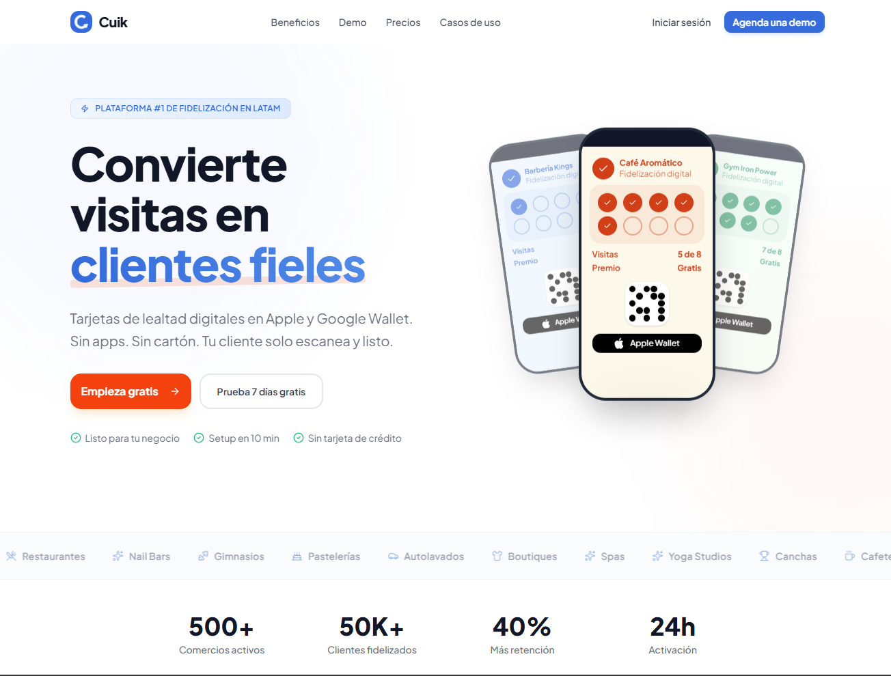

<p align="center">
  
</p>

<h1 align="center">Cuik</h1>

<p align="center">
  <strong>Fidelizacion wallet-native para comercios fisicos en LATAM.</strong><br/>
  Tarjetas de lealtad digitales en Apple y Google Wallet. Sin apps. Sin carton. Listo en minutos.
</p>

<p align="center">
  
  
  
  
  
  
  
</p>

<p align="center">
  
</p>

---

## Stack

| Capa | Tecnologia |
|------|-----------|
| Monorepo | [Turborepo](https://turbo.build) + [pnpm](https://pnpm.io) workspaces |
| Framework | [Next.js 16](https://nextjs.org) (App Router, RSC) |
| Lenguaje | TypeScript 5.7 |
| UI | [Tailwind CSS 4](https://tailwindcss.com) + [shadcn/ui](https://ui.shadcn.com) |
| Componentes | [Radix UI](https://radix-ui.com) + [Lucide Icons](https://lucide.dev) |
| Charts | [Recharts](https://recharts.org) |
| React | 19.2 |

## Estructura

```
cuik_loyanty/
├── apps/
│   └── web/                 # Next.js 16 — app principal
│       ├── app/
│       │   ├── (landing)/   # Landing publica + contacto + registro
│       │   ├── (auth)/      # Login, register, forgot-password
│       │   ├── (dashboard)/ # Panel admin-comercio → /panel/*
│       │   ├── (super-admin)/ # Panel super-admin → /admin/*
│       │   ├── (cajero)/    # Panel cajero → /cajero/*
│       │   ├── [tenant]/    # Registro publico por tenant
│       │   └── api/         # API routes
│       │       ├── solicitudes/        # POST — lead capture (publico)
│       │       ├── admin/solicitudes/  # GET, PATCH — SA gestiona leads
│       │       ├── admin/tenants/      # GET, PATCH — SA gestiona tenants
│       │       ├── admin/assets/       # POST upload — MinIO asset storage
│       │       ├── admin/generate-assets/ # POST — AI image generation (nano-banana)
│       │       ├── assets/             # GET [...key] — public asset proxy (MinIO)
│       │       ├── [tenant]/info/      # GET — info publica del tenant
│       │       ├── [tenant]/register-client/  # POST — registro de clientes
│       │       ├── [tenant]/visits/    # POST — registro de visitas
│       │       ├── [tenant]/redeem/    # POST — canje de rewards
│       │       ├── [tenant]/wallet/    # Apple/Google Wallet pass generation
│       │       ├── [tenant]/analytics/ # GET — visits, retention, summary
│       │       ├── [tenant]/campaigns/ # POST/GET — campaign CRUD + send
│       │       ├── [tenant]/clients/   # Notes, tags, export CSV, communications
│       │       ├── [tenant]/tags/      # POST/GET — tag CRUD
│       │       ├── apple-wallet/       # Apple Web Service Protocol
│       │       ├── cron/              # Analytics daily, retention, scheduled campaigns
│       │       └── seed/               # GET — seed de desarrollo
│       ├── components/      # Componentes compartidos (CuikLogo, shadcn/ui)
│       └── lib/             # Auth config, API utils, utilidades
│           ├── analytics/   # Aggregation engine (visits-daily, retention, summary)
│           ├── campaigns/   # Segment resolver, campaign executor
│           ├── crm/         # CSV streaming export
│           └── loyalty/     # Business logic (register-visit, redeem-reward)
├── packages/
│   ├── db/                  # Drizzle ORM — schemas, migrations, seed
│   ├── shared/              # Types, validators (Zod), constants
│   ├── ui/                  # shadcn/ui components compartidos
│   ├── editor/              # Editor visual de pases (react-konva + Zustand)
│   ├── wallet/              # Apple/Google Wallet (passkit-generator + jose)
│   └── email/               # React Email templates + Resend transport
├── turbo.json
├── pnpm-workspace.yaml
└── .npmrc                   # Hoist patterns para Tailwind en monorepo
```

## Requisitos previos

- **Node.js** >= 18.18
- **pnpm** >= 10.x (`corepack enable && corepack prepare pnpm@10.12.1 --activate`)
- **PostgreSQL** >= 16 (local o Docker)
- **Docker** (para MinIO y Redis en desarrollo)
- **nano-banana** (opcional, para generacion IA de assets)

## Instalacion

```bash
# 1. Clonar el repositorio
git clone https://github.com/YOUR_ORG/cuik-loyanty.git
cd cuik_loyanty

# 2. Instalar dependencias
pnpm install

# 3. Configurar la base de datos
# Crear la DB cuik en PostgreSQL, luego:
cd packages/db
pnpm db:migrate
cd ../..

# 4. Levantar el servidor de desarrollo
pnpm dev

# 5. Seed de datos (una vez con el server corriendo)
# Visitar: http://localhost:3000/api/seed
```

El servidor arranca en **http://localhost:3000**.

### Rutas disponibles

| Ruta | Descripcion | Estado |
|------|------------|--------|
| `/` | Landing page (hero, demo, diferenciadores, pricing, social proof, CTA) | Mock UI |
| `/registro` | Formulario de solicitud de comercio (contacto, NO crea cuenta) | Mock UI |
| `/login` | Login (admin-comercio / super-admin / cajero) | **Funcional** |
| `/register` | Registro para admins invitados por SA | Mock UI |
| `/forgot-password` | Recuperacion de contraseña | Mock UI |
| `/panel` | Dashboard admin-comercio | Mock UI (datos de seed) |
| `/panel/mi-pase` | Vista solo lectura del pase actual | Mock UI |
| `/panel/clientes` | Gestion de clientes + export CSV + notas + tags | **Funcional** |
| `/panel/clientes/[id]` | Detalle del cliente (Info, Notas, Tags, Comunicaciones) | **Funcional** |
| `/panel/cajeros` | Gestion de cajeros (invitacion por magic link) | Mock UI |
| `/panel/campanas` | Campañas push con segmentacion + scheduling | **Funcional** |
| `/panel/analitica` | Dashboard con Recharts (visitas, retention, KPIs) | **Funcional** |
| `/panel/configuracion` | Configuracion del comercio (plan solo lectura) | Mock UI |
| `/admin/tenants` | SA: solicitudes + gestion de tenants | Mock UI |
| `/admin/editor` | SA: editor visual de pases (3 paneles) | Mock UI |
| `/admin/branding` | SA: editor de tema/branding por comercio | Mock UI |
| `/admin/planes` | SA: gestion de planes | Mock UI |
| `/admin/metricas` | SA: metricas globales | Mock UI |
| `/admin/configuracion` | SA: configuracion global | Mock UI |
| `/cajero/escanear` | Panel cajero: escanear QR | Mock UI |
| `/cajero/buscar` | Panel cajero: buscar cliente | Mock UI |
| `/cajero/historial` | Panel cajero: historial | Mock UI |
| `/[tenant]/registro` | Registro de cliente con branding del comercio | Mock UI |
| `/[tenant]/bienvenido` | Bienvenida post-registro con preview de pase + wallet | Mock UI |

### API Endpoints

| Endpoint | Metodo | Auth | Descripcion | Estado |
|----------|--------|------|-------------|--------|
| `/api/solicitudes` | POST | Publico | Crear solicitud/lead desde landing | **Funcional** |
| `/api/admin/solicitudes` | GET | super_admin | Listar solicitudes con filtros | **Funcional** |
| `/api/admin/solicitudes/[id]` | PATCH | super_admin | Aprobar/rechazar solicitud | **Funcional** |
| `/api/admin/tenants` | GET | super_admin | Listar tenants con stats | **Funcional** |
| `/api/admin/tenants/[id]` | PATCH | super_admin | Actualizar tenant | **Funcional** |
| `/api/[tenant]/info` | GET | Publico | Info publica del tenant | **Funcional** |
| `/api/[tenant]/register-client` | POST | auth + member | Registrar cliente con QR | **Funcional** |
| `/api/[tenant]/visits` | POST | auth + member | Registrar visita (ciclo de sellos) | **Funcional** |
| `/api/[tenant]/redeem` | POST | auth + member | Canjear reward | **Funcional** |
| `/api/[tenant]/clients` | GET | auth + member | Listar clientes del tenant | **Funcional** |
| `/api/[tenant]/wallet/apple/[clientId]` | GET | auth + member | Generar .pkpass | **Funcional** |
| `/api/[tenant]/wallet/google/[clientId]` | POST | auth + member | Generar save-to-wallet link | **Funcional** |
| `/api/[tenant]/wallet/status/[clientId]` | GET | auth + member | Estado wallet del cliente | **Funcional** |
| `/api/apple-wallet/v1/[...path]` | * | Apple | Web Service Protocol (device reg, pass refresh) | **Funcional** |
| `/api/admin/pass-designs/[id]/preview` | POST | super_admin | Preview strip image | **Funcional** |
| `/api/admin/assets/upload` | POST | super_admin | Upload asset a MinIO (multipart, 5MB max) | **Funcional** |
| `/api/admin/generate-assets` | POST | super_admin | Generar imagen con IA (nano-banana) | **Funcional** |
| `/api/assets/[...key]` | GET | Publico | Proxy de assets MinIO (cache immutable) | **Funcional** |
| `/api/[tenant]/analytics/visits` | GET | admin | Visitas diarias (day/week/month) | **Funcional** |
| `/api/[tenant]/analytics/retention` | GET | admin | Cohortes de retencion | **Funcional** |
| `/api/[tenant]/analytics/summary` | GET | admin | KPIs agregados | **Funcional** |
| `/api/[tenant]/campaigns` | POST/GET | admin | Crear/listar campañas | **Funcional** |
| `/api/[tenant]/campaigns/[id]` | GET | admin | Detalle de campaña con stats | **Funcional** |
| `/api/[tenant]/campaigns/[id]/send` | POST | admin | Ejecutar campaña (push batch) | **Funcional** |
| `/api/[tenant]/campaigns/[id]/preview` | GET | admin | Preview segment count | **Funcional** |
| `/api/[tenant]/clients/[id]/notes` | POST/GET | admin | Notas del cliente | **Funcional** |
| `/api/[tenant]/clients/[id]/tags` | POST/GET | admin | Tags del cliente | **Funcional** |
| `/api/[tenant]/clients/[id]/communications` | GET | admin | Historial de comunicaciones | **Funcional** |
| `/api/[tenant]/clients/export` | GET | admin | Export CSV streaming | **Funcional** |
| `/api/[tenant]/tags` | POST/GET | admin | CRUD de tags | **Funcional** |
| `/api/cron/analytics-daily` | POST | CRON_SECRET | Recalcular visits_daily | **Funcional** |
| `/api/cron/analytics-retention` | POST | CRON_SECRET | Recalcular retention cohorts | **Funcional** |
| `/api/cron/campaigns-scheduled` | POST | CRON_SECRET | Ejecutar campañas programadas | **Funcional** |
| `/api/seed` | GET | — | Seed de datos de desarrollo | **Funcional** |

### Usuarios iniciales

El seed crea un Super Admin con las credenciales configuradas en las variables de entorno. Consulta el [Manual de Deployment](docs/MANUAL_DEPLOYMENT.md) para la configuración completa.

## Scripts

```bash
pnpm dev         # Desarrollo con hot reload
pnpm build       # Build de produccion
pnpm lint        # Biome lint
pnpm format      # Biome format
pnpm typecheck   # TypeScript check (7 packages)

# Database (desde packages/db/)
pnpm db:generate # Generar migrations
pnpm db:migrate  # Ejecutar migrations
pnpm db:seed     # Seed de desarrollo
pnpm db:studio   # Drizzle Studio
```

## Estado actual

Backend funcional con 7 sprints completados: auth, API core, loyalty, wallet, editor visual, email + storage + IA, campañas + analytics + CRM. 360 unit tests, typecheck 7/7 packages. El PRD completo esta en [`docs/PRD_CUIK.md`](docs/PRD_CUIK.md).

### Roadmap

- [x] **Sprint 0 — Mock UI + CLAUDE.md** — 12 mejoras UI (M1-M12), convenciones, Biome
- [x] **Sprint 1 — Base de datos + Auth** — PostgreSQL multi-schema, Drizzle ORM, Better Auth, seed, login funcional
- [x] **Sprint 2 — API Core** — Solicitudes, tenants, clientes, helpers compartidos, tenant isolation
- [x] **Sprint 3 — Loyalty Core** — Visitas, rewards, ciclos de sellos, panel cajero funcional
- [x] **Sprint 4 — Wallet Integration** — Apple Wallet (.pkpass), Google Wallet (JWT save links)
- [x] **Sprint 5 — Editor visual de pases** — react-konva, drag-and-drop, export a strip images
- [x] **Sprint 6 — Email + Storage + IA** — React Email + Resend, MinIO, nano-banana AI generation
- [x] **Sprint 7 — Campañas + Analytics + CRM** — Push notifications, Recharts dashboards, segmentacion, notas/tags, CSV export
- [ ] **Sprint 8 — Deploy + Polish** — Docker, CI/CD, Dokploy, security hardening

## Licencia

Privado. Todos los derechos reservados.
