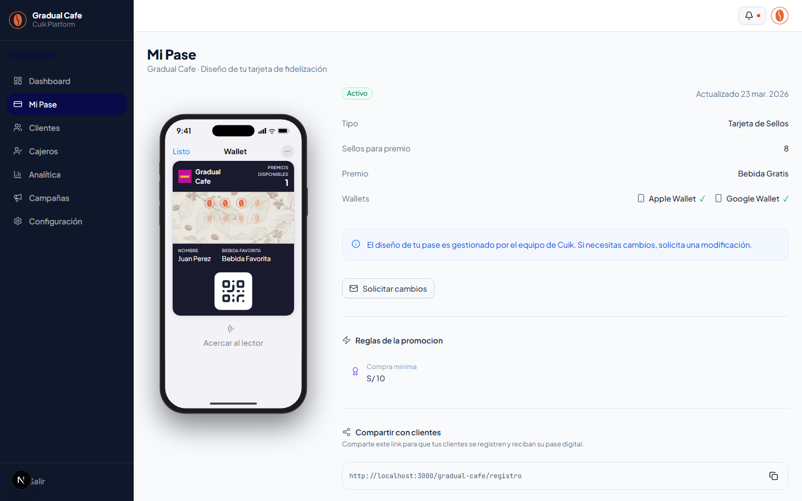
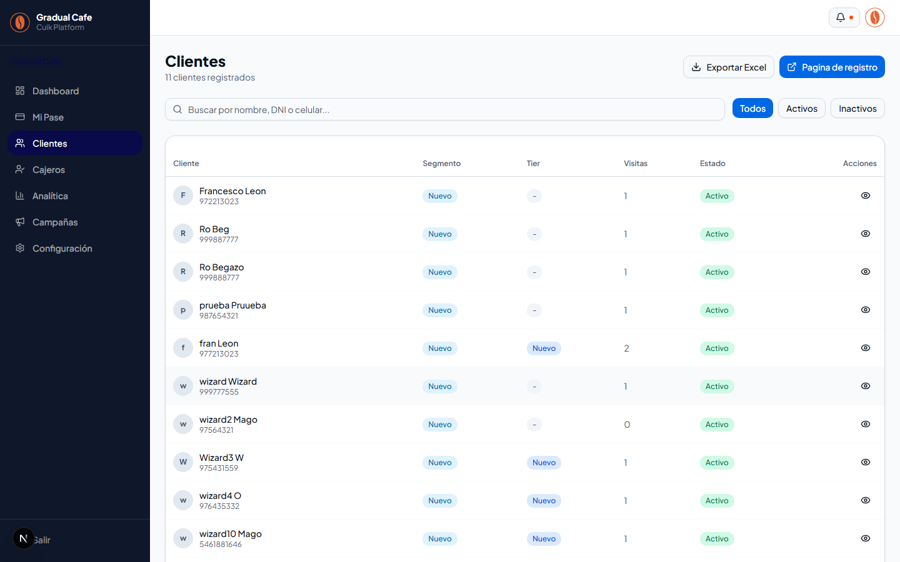
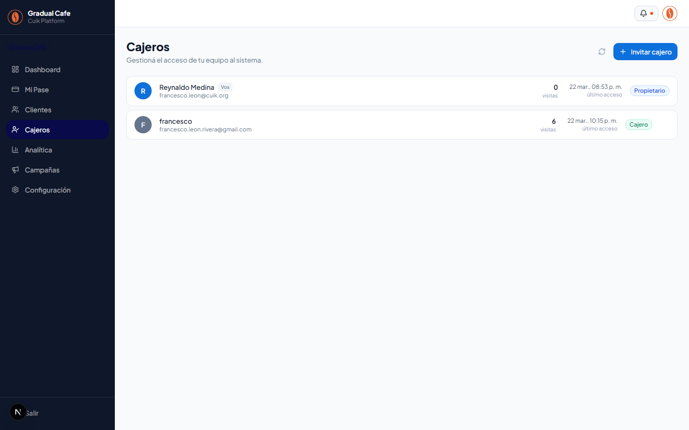
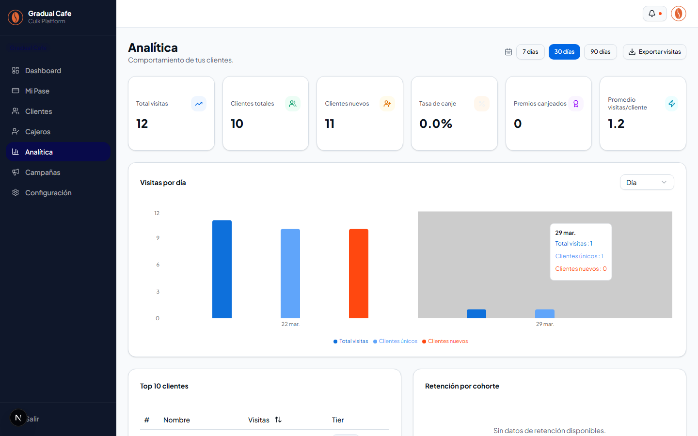
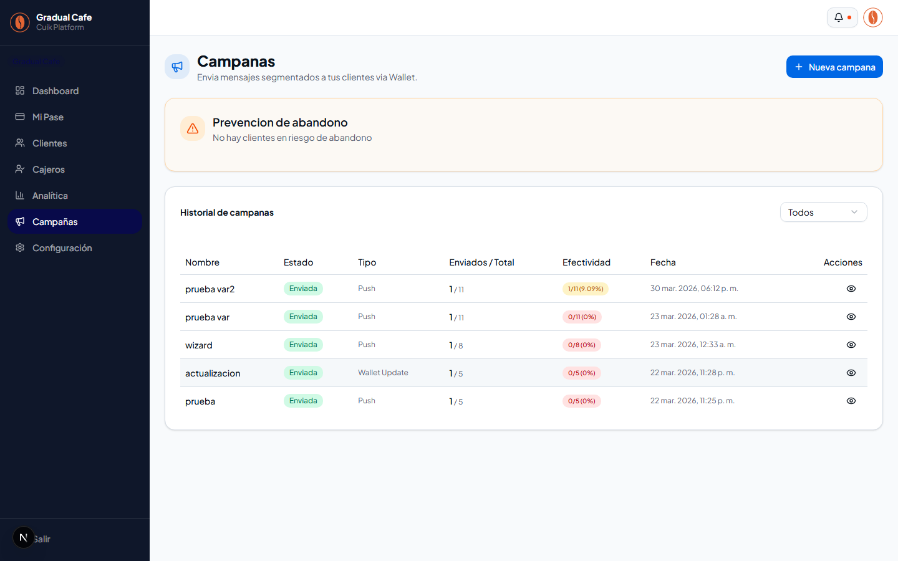
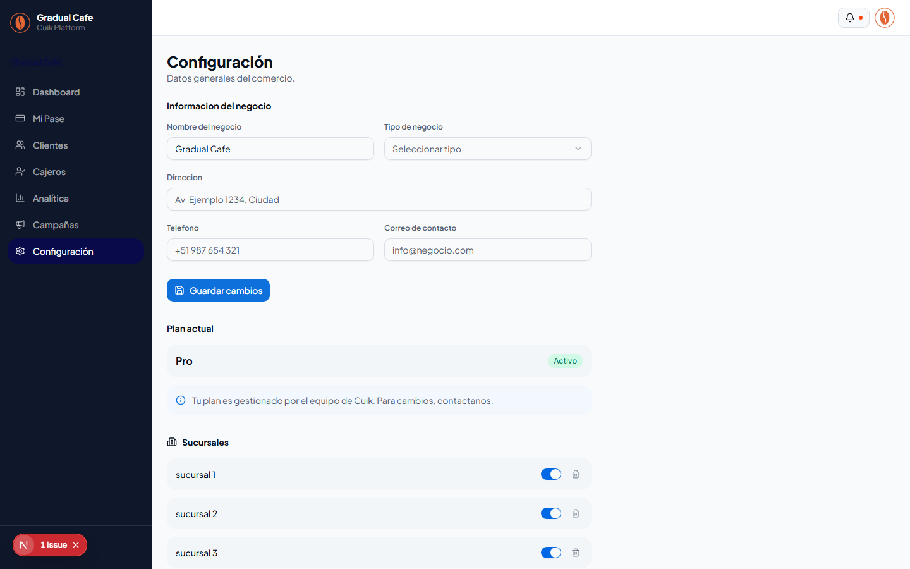

# Manual de Usuario — Admin del Comercio

> **Plataforma**: Cuik — Fidelizacion wallet-native para comercios fisicos
> **Rol**: Admin (dueno/administrador del comercio)
> **Ultima actualizacion**: 2026-03-30

---

## Indice

1. [Primer acceso](#1-primer-acceso)
2. [Dashboard](#2-dashboard-panel)
3. [Mi Pase](#3-mi-pase-panelmi-pase)
4. [Clientes](#4-clientes-panelclientes)
5. [Cajeros](#5-cajeros-panelcajeros)
6. [Analitica](#6-analitica-panelanalitica)
7. [Campanas](#7-campanas-panelcampanas)
8. [Configuracion](#8-configuracion-panelconfiguracion)
9. [Link de registro de clientes](#9-link-de-registro-de-clientes)

---

## 1. Primer acceso

### Recibir credenciales

El equipo de Cuik (Super Admin) crea tu comercio en la plataforma y te envia un correo con:

- **URL de acceso**: `https://app.cuik.org/login`
- **Email** de tu cuenta
- **Contrasena temporal**

### Iniciar sesion

1. Abre tu navegador y ve a la URL de login
2. Ingresa tu **email** y **contrasena**
3. Haz clic en **"Iniciar sesion"**


4. El sistema te redirige automaticamente a `/panel` (tu Dashboard)

> **Nota**: Si olvidas tu contrasena, usa el enlace "Olvide mi contrasena" en la pantalla de login para recibir un correo de recuperacion.

---

## 2. Dashboard (`/panel`)

El Dashboard es tu pantalla principal. Muestra un resumen en tiempo real del estado de tu negocio.


### Encabezado

Muestra el titulo "Dashboard", el nombre de tu comercio y la fecha actual en formato legible (ejemplo: "viernes, 14 de marzo de 2026").

### 4 tarjetas de KPIs

| Tarjeta | Que muestra |
|---------|-------------|
| **Visitas hoy** | Cantidad de visitas registradas en el dia, con subtexto de visitas de la semana |
| **Clientes activos** | Total de clientes registrados en tu comercio |
| **Nuevos hoy** | Clientes que se registraron hoy |
| **Premios pendientes** | Premios generados que aun no se canjearon |

### Grafico de visitas semanal

Un grafico de barras que muestra las visitas de los ultimos 7 dias, agrupadas por dia de la semana. Te permite ver tendencias rapidas de actividad.


### Transacciones recientes

Una tabla con las ultimas 10 visitas registradas. Cada fila muestra:

- **Hora** (formato HH:MM)
- **Nombre del cliente**
- **Numero de sello y ciclo** (ejemplo: "Sello 3 (ciclo 1)")

Si no hay transacciones, muestra el mensaje "Sin transacciones recientes".


---

## 3. Mi Pase (`/panel/mi-pase`)

Esta seccion te muestra como luce actualmente la tarjeta de fidelizacion de tu comercio en Apple Wallet y Google Wallet. **Es solo lectura** — el diseno es gestionado por el equipo de Cuik.



### Que veras

- **Preview del pase**: una representacion realista de tu tarjeta dentro de un marco de celular (PhoneFrame). Muestra los colores, logo, imagen de fondo y estructura tal como lo ven tus clientes
- **Adaptacion por tipo de promocion**:
  - **Sellos**: muestra la grilla de sellos y el progreso del ciclo actual
  - **Puntos**: muestra el balance de puntos y nivel del cliente
- **Reglas de la promocion**: seccion de solo lectura con las reglas configuradas (cuantos sellos se necesitan, que premio se gana, etc.)
- **Catalogo de recompensas**: solo para promociones de puntos, muestra los items canjeables con su costo en puntos (solo lectura)
- **Campos traseros (BackFields)**: informacion adicional configurada en el reverso del pase

### Link de registro

En esta pagina tambien encontraras el **link de registro de clientes** de tu comercio. Es la URL que tus clientes usan para registrarse y obtener su pase digital. Mas detalles en la [seccion 9](#9-link-de-registro-de-clientes).

### Solicitar cambios

Si necesitas modificar el diseno de tu pase (colores, logo, reglas del programa), haz clic en el boton **"Solicitar cambios"**. Esto envia una notificacion al equipo de Cuik para que se pongan en contacto contigo.

> **Importante**: El admin NO puede editar pases directamente. Esto lo gestiona el equipo de Cuik para garantizar calidad y consistencia.

---

## 4. Clientes (`/panel/clientes`)

Aqui gestionas la lista completa de clientes de tu comercio.



### Lista de clientes

La tabla muestra:

| Columna | Descripcion |
|---------|-------------|
| **Cliente** | Avatar con inicial + nombre completo |
| **Segmento (Tier)** | Badge con el nivel del cliente |
| **Visitas** | Total de visitas registradas |
| **Estado** | Activo o inactivo |
| **Acciones** | Icono de ojo para ver detalle |

### Segmentos de clientes

Los clientes se clasifican automaticamente segun su actividad:

| Segmento | Color | Criterio |
|----------|-------|----------|
| **Nuevo** | Azul | Cliente recien registrado |
| **Regular** | Verde | Cliente con actividad habitual |
| **VIP** | Ambar | Cliente con alta frecuencia de visitas |
| **En riesgo** | — | Cliente que esta dejando de visitar |
| **Inactivo** | Gris | Cliente sin actividad reciente |

### Buscar clientes

Usa la barra de busqueda para filtrar por **nombre**, **DNI** o **numero de celular**. La busqueda se ejecuta automaticamente mientras escribes (con un pequeno retraso para no sobrecargar el sistema).

### Filtrar por estado

Usa los botones **Todos** / **Activos** / **Inactivos** para filtrar la lista segun el estado del cliente.

### Exportar a Excel/CSV

Haz clic en el boton **"Exportar CSV"** en la parte superior para descargar la lista completa de clientes en formato CSV (compatible con Excel). El archivo incluye la fecha en el nombre.

### Ver detalle de un cliente

Haz clic en cualquier fila de la tabla (o en el icono del ojo) para ir al detalle del cliente.

<!-- TODO: capture screenshot for detalle de un cliente con stats y tabs -->

#### Informacion del detalle

- **Encabezado**: avatar, nombre completo, telefono, email, DNI
- **4 tarjetas de estadisticas**: visitas totales, sellos actuales (X/Y), premios pendientes, ciclo actual
- **Barra de progreso**: visualizacion del avance en el ciclo actual
- **Alerta de premios**: si el cliente tiene premios pendientes de canjear, se muestra un banner ambar

#### 4 tabs de informacion

1. **Informacion**: datos personales del cliente (nombre, apellido, celular, email, DNI, fecha de registro, tier, estado)
2. **Notas**: agrega notas internas sobre el cliente (ejemplo: "Prefiere servicio express", "Cliente frecuente de los viernes"). Las notas incluyen fecha y autor
3. **Tags**: asigna etiquetas al cliente para segmentacion. Puedes crear tags nuevos con nombre y color personalizado (8 colores disponibles)
4. **Comunicaciones**: historial de notificaciones enviadas a este cliente, con detalle de campana, canal (Wallet Push/Email), estado (Enviado/Entregado/Fallido/Pendiente) y fecha

### Paginacion

Si tienes mas de 20 clientes, la tabla se pagina. Usa los botones **Anterior** / **Siguiente** en la parte inferior.

---

## 5. Cajeros (`/panel/cajeros`)

Gestiona los accesos del personal que registra visitas en tu local.



### Lista de cajeros

Cada cajero se muestra con:

- **Avatar** con inicial y color segun rol (azul = propietario, gris = cajero)
- **Nombre y email**
- **Visitas registradas** (total de visitas que registro ese cajero)
- **Ultimo acceso** (fecha y hora)
- **Estado**: badge de "Propietario", "Cajero" (activo) o "Inactivo"

El propietario (tu cuenta) siempre aparece primero en la lista y tiene un badge "Vos" al lado del nombre.

### Invitar un nuevo cajero

1. Haz clic en **"Invitar cajero"** (boton azul en la esquina superior derecha)
2. Se abre un formulario con un campo de **email**
3. Ingresa el email del cajero y haz clic en **"Enviar"**
4. El sistema envia un email de invitacion al cajero
5. La invitacion aparece en la lista como **"Pendiente"** (borde punteado ambar)

> **Nota**: El cajero recibe un email con un link. Al hacer clic, crea su cuenta y se une automaticamente a tu comercio.

### Gestionar cajeros existentes

Al pasar el mouse sobre un cajero (que no sea el propietario), aparece un menu de tres puntos con las siguientes opciones:

| Accion | Descripcion |
|--------|-------------|
| **Editar nombre** | Cambia el nombre del cajero en el sistema |
| **Resetear contrasena** | Genera una contrasena temporal. Se muestra en pantalla para que la copies y compartas de forma segura |
| **Desactivar** | Bloquea el acceso del cajero sin eliminarlo. Puede reactivarse despues |
| **Activar** | Reactiva un cajero desactivado |
| **Eliminar miembro** | Elimina permanentemente al cajero del sistema (no se puede deshacer) |

### Invitaciones pendientes

Las invitaciones que aun no fueron aceptadas aparecen en una seccion separada. Puedes:

- **Reenviar** la invitacion (icono de enviar)
- **Cancelar** la invitacion (icono de X)

---

## 6. Analitica (`/panel/analitica`)

Panel de analitica avanzada con metricas detalladas del comportamiento de tus clientes.



### Selector de rango

En la parte superior, puedes elegir el periodo de analisis:

- **7 dias** — ultima semana
- **30 dias** — ultimo mes (por defecto)
- **90 dias** — ultimos 3 meses

### 6 tarjetas de KPIs

| KPI | Descripcion |
|-----|-------------|
| **Total visitas** | Visitas en el periodo seleccionado |
| **Clientes totales** | Total de clientes registrados |
| **Clientes nuevos** | Clientes que se registraron en el periodo |
| **Tasa de canje (%)** | Porcentaje de premios canjeados vs generados |
| **Premios canjeados** | Total de premios canjeados en el periodo |
| **Promedio visitas/cliente** | Promedio de visitas por cliente |

### Grafico de visitas

Grafico de barras con 3 metricas por periodo:

- **Total visitas** (azul)
- **Clientes unicos** (verde)
- **Clientes nuevos** (ambar)

Puedes cambiar la granularidad del grafico:

- **Dia**: una barra por dia
- **Semana**: una barra por semana
- **Mes**: una barra por mes


### Top 10 clientes

Tabla con los clientes mas activos, ordenados por cantidad de visitas (descendente). Muestra ranking, nombre, total de visitas y segmento. Puedes invertir el orden haciendo clic en el encabezado de la columna "Visitas".

### Heatmap de retencion

Tabla de cohortes mensuales que muestra que porcentaje de clientes vuelve despues de registrarse. Los porcentajes estan coloreados:

- **Verde**: retencion alta
- **Ambar**: retencion media
- **Rojo**: retencion baja

Si no hay suficientes datos, muestra "Sin datos de retencion disponibles."

---

## 7. Campanas (`/panel/campanas`)

Crea y envia mensajes segmentados a tus clientes via notificaciones de Wallet.



### Lista de campanas

Muestra tus campanas con:

- **Nombre** de la campana
- **Estado**: badge con color
  - Borrador (gris)
  - Programada (azul)
  - Enviando (ambar)
  - Enviada (verde)
  - Cancelada (rojo)
- **Tipo**: Push Notification o Wallet Update
- **Enviados / Total**: cuantos mensajes se enviaron vs el total
- **Fecha** de creacion o envio
- **Acciones**: ver detalle (icono ojo) y enviar (icono de enviar, solo para borradores y programadas)

Puedes filtrar campanas por estado usando el selector en la parte superior del historial.

### Crear una nueva campana

1. Haz clic en **"Nueva campana"**
2. Se abre un formulario (dialog) con los siguientes campos:

#### Nombre de la campana

Nombre descriptivo para identificar la campana (ejemplo: "Promo fin de semana").

#### Tipo de campana

| Tipo | Descripcion |
|------|-------------|
| **Push Notification** | Envia una notificacion visible al cliente con tu mensaje |
| **Wallet Update** | Actualiza silenciosamente los pases de todos los clientes seleccionados (no muestra notificacion) |

#### Mensaje

Escribe el mensaje que recibiran tus clientes. Limite de **150 caracteres**. El contador se muestra debajo del campo y cambia de color cuando te acercas al limite.

**Variables disponibles**: puedes personalizar el mensaje con datos del cliente usando el boton **"Insertar variable"**:

| Variable | Descripcion |
|----------|-------------|
| `{{client.name}}` | Nombre del cliente |
| `{{stamps.current}}` | Sellos en el ciclo actual |
| `{{stamps.max}}` | Sellos necesarios para el premio |
| `{{stamps.remaining}}` | Sellos que le faltan |
| `{{stamps.total}}` | Visitas totales del cliente |
| `{{rewards.pending}}` | Premios pendientes |
| `{{points.balance}}` | Balance de puntos |
| `{{tenant.name}}` | Nombre de tu comercio |

Ejemplo de mensaje: `Hola {{client.name}}! Te faltan {{stamps.remaining}} sellos para tu premio en {{tenant.name}}. Te esperamos!`

#### Segmento

Elige a quien enviar la campana:

| Segmento | Descripcion |
|----------|-------------|
| **Todos** | Todos los clientes registrados |
| **Activos** | Clientes con actividad reciente |
| **Inactivos** | Clientes sin actividad reciente |
| **VIP** | Clientes con alta frecuencia |
| **Nuevos** | Clientes registrados recientemente |
| **Personalizado** | Define filtros avanzados |

Si eliges **Personalizado**, se muestran filtros adicionales:

- **Min/Max visitas**: rango de visitas totales
- **Ultima visita despues de / antes de**: rango de fechas
- Se muestran badges con los filtros aplicados

#### Programar envio

Activa el interruptor **"Programar envio"** si quieres que la campana se envie en una fecha y hora futura. Se muestra un selector de fecha y hora.

3. Haz clic en **"Crear campana"** (o **"Programar"** si configuraste fecha futura)

### Enviar una campana

Las campanas se crean como **borrador**. Para enviarla:

1. Busca la campana en la lista
2. Haz clic en el icono de **enviar** (flecha) en la columna de acciones
3. Confirma el envio

El estado cambiara a "Enviando" y luego a "Enviada" cuando se complete.

---

## 8. Configuracion (`/panel/configuracion`)

Gestiona los datos generales de tu comercio.



### Informacion del negocio

Formulario editable con los siguientes campos:

| Campo | Descripcion |
|-------|-------------|
| **Nombre** | Nombre de tu comercio |
| **Tipo de negocio** | Selector con 11 opciones (cafeteria, restaurante, barberia, veterinaria, etc.) |
| **Direccion** | Direccion fisica del local |
| **Telefono** | Numero de contacto |
| **Correo de contacto** | Email de contacto del comercio |

Para guardar los cambios, haz clic en **"Guardar cambios"**. El sistema valida los campos antes de guardar.

### Sucursales

Si tu comercio tiene multiples sucursales, puedes gestionarlas aqui:

- **Crear** nueva sucursal (nombre, direccion)
- **Editar** sucursales existentes
- **Activar/Desactivar** sucursales

Las sucursales activas aparecen como opciones cuando los cajeros registran visitas.

### Plan actual

Seccion de solo lectura que muestra informacion sobre tu plan activo en Cuik. Los planes son gestionados directamente por el equipo de Cuik (cobro externo via transferencia o Yape).

> **Nota**: Si necesitas cambiar de plan o tienes consultas sobre facturacion, contacta al equipo de Cuik.

---

## 9. Link de registro de clientes

Tu comercio tiene una pagina de registro publica donde tus clientes se registran para obtener su pase digital de fidelizacion.

### URL de registro

```
https://app.cuik.org/{tu-slug}/registro
```

Donde `{tu-slug}` es el identificador unico de tu comercio (ejemplo: `mascotaveloz`).

### Como usarlo

1. **Comparte el link** con tus clientes via redes sociales, WhatsApp, impreso en el local, etc.
2. **Imprime un QR** que apunte a esta URL y pegalo en un lugar visible de tu local (caja, puerta, mesa)
3. El cliente abre el link, completa sus datos, y recibe su pase digital de sellos en Apple Wallet o Google Wallet

### Que ve el cliente

1. Un formulario con campos: nombre, apellido, celular, email (opcional), DNI (opcional)
2. Al enviar, recibe un boton para agregar el pase a su wallet
3. El pase queda guardado en su celular con el diseno de tu comercio

> **Tip**: El link de registro tambien esta disponible en la pagina [Mi Pase](#3-mi-pase-panelmi-pase) y en la lista de [Clientes](#4-clientes-panelclientes).

---

## Navegacion general

### Sidebar

El panel de administracion tiene un sidebar (barra lateral) oscuro con:

- **Logo** de Cuik
- **Nombre y logo** de tu comercio
- **7 items de navegacion**: Dashboard, Mi Pase, Clientes, Cajeros, Analitica, Campanas, Configuracion
- **Boton "Salir"**: cierra tu sesion

En dispositivos moviles, el sidebar se abre/cierra con el boton hamburguesa (tres lineas) en la esquina superior izquierda.

### Cerrar sesion

Haz clic en **"Salir"** en el sidebar para cerrar tu sesion de forma segura. Seras redirigido a la pantalla de login.

---

## Preguntas frecuentes

### Puedo editar el diseno de mi pase?

No directamente. El diseno es creado y gestionado por el equipo de Cuik. Puedes solicitar cambios desde la pagina [Mi Pase](#3-mi-pase-panelmi-pase).

### Un cajero no puede entrar al sistema, que hago?

Ve a [Cajeros](#5-cajeros-panelcajeros) y verifica:
1. Que el cajero este en la lista (no eliminado)
2. Que no este marcado como "Inactivo" (desactivado)
3. Si olvido su contrasena, usa la opcion "Resetear contrasena" del menu de tres puntos

### Como se que mis campanas se enviaron correctamente?

En la lista de [Campanas](#7-campanas-panelcampanas), el estado cambiara a "Enviada" (badge verde) y podras ver la columna "Enviados/Total" con la cantidad de mensajes entregados.

### Mis clientes no reciben las notificaciones push

Las notificaciones push solo funcionan si:
1. El cliente tiene el pase guardado en su wallet (Apple o Google)
2. El tipo de campana es "Push Notification" (no "Wallet Update")
3. El dispositivo del cliente tiene conexion a internet y notificaciones habilitadas
