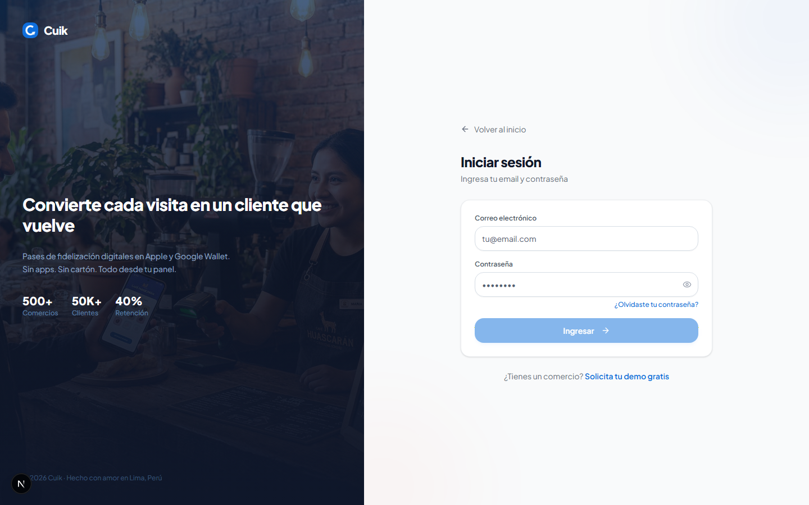
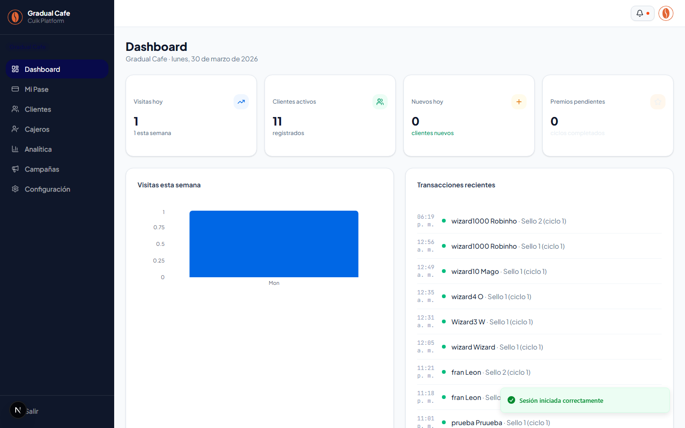
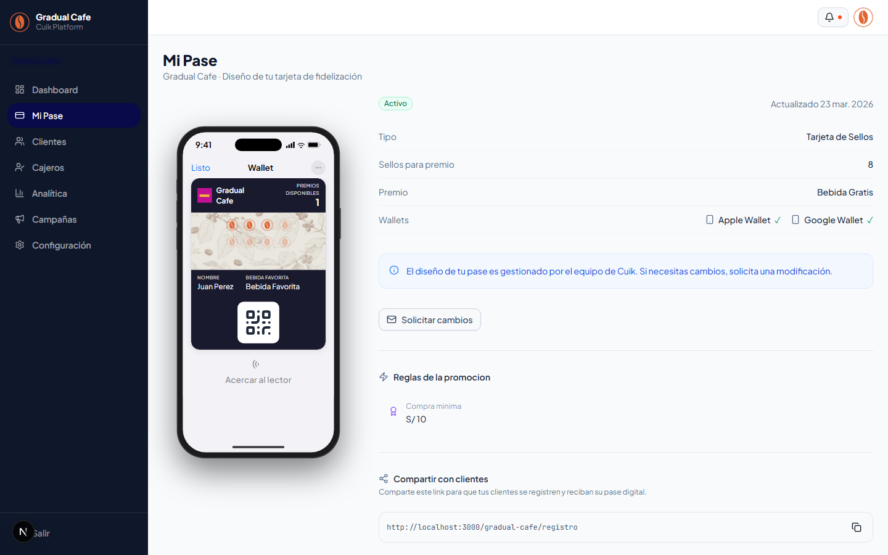
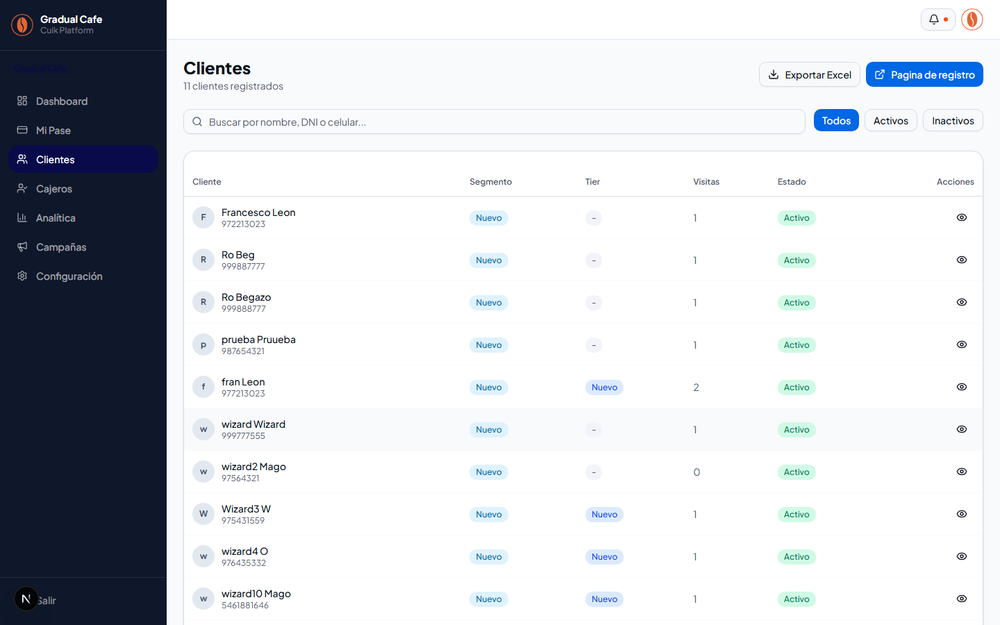
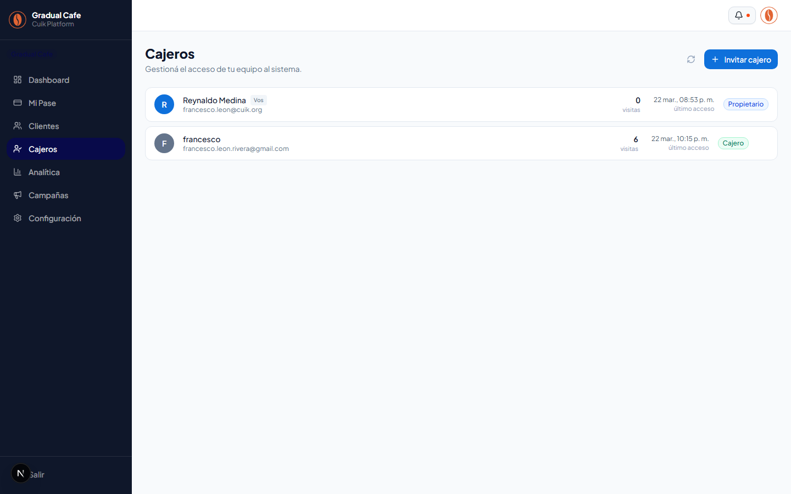
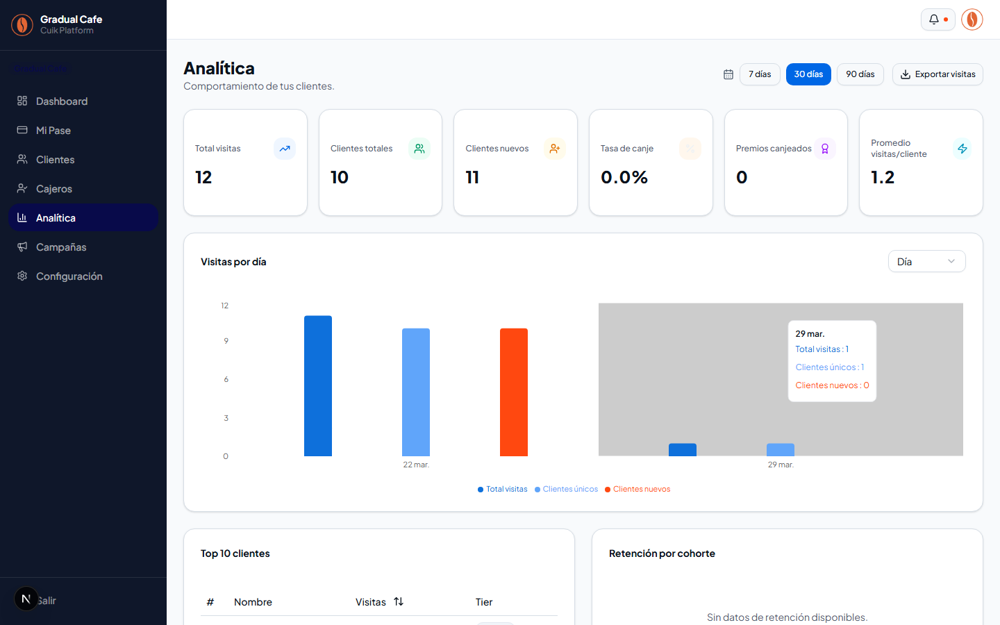
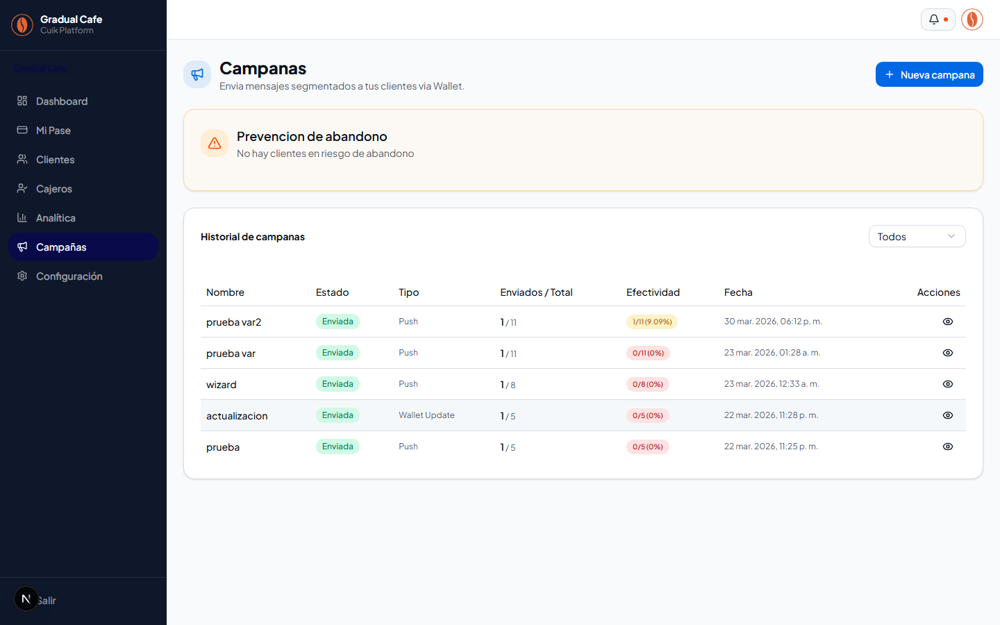
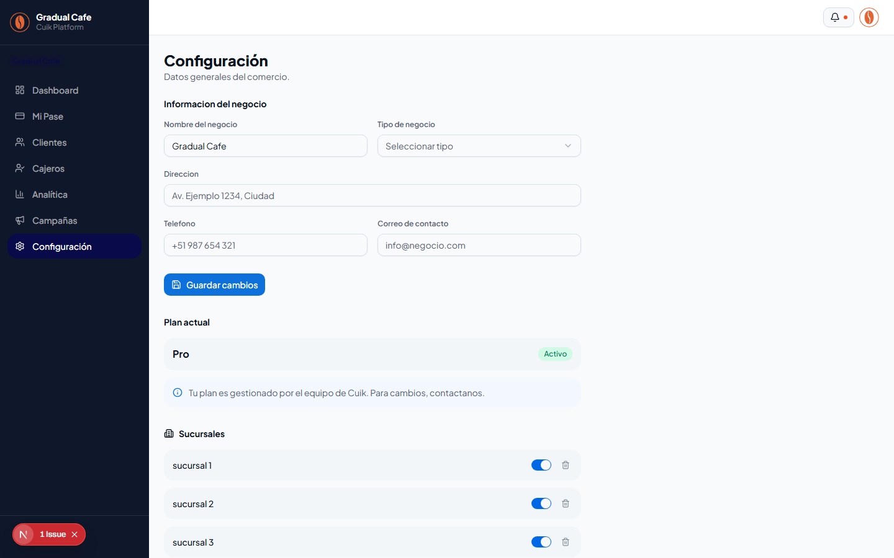

# Manual de Usuario — Admin del Comercio

> **Plataforma**: Cuik — Fidelizacion wallet-native para comercios fisicos
> **Rol**: Admin (dueno/administrador del comercio)
> **Ultima actualizacion**: 2026-03-30

---

## Indice

1. [Primer acceso](#1-primer-acceso)
2. [Dashboard](#2-dashboard-panel)
3. [Mi Pase](#3-mi-pase-panelmi-pase)
4. [Clientes](#4-clientes-panelclientes)
5. [Cajeros](#5-cajeros-panelcajeros)
6. [Analitica](#6-analitica-panelanalitica)
7. [Campanas](#7-campanas-panelcampanas)
8. [Configuracion](#8-configuracion-panelconfiguracion)
9. [Link de registro de clientes](#9-link-de-registro-de-clientes)

---

## 1. Primer acceso

### Recibir credenciales

El equipo de Cuik (Super Admin) crea tu comercio en la plataforma y te envia un correo con:

- **URL de acceso**: `https://app.cuik.org/login`
- **Email** de tu cuenta
- **Contrasena temporal**

### Iniciar sesion

1. Abre tu navegador y ve a la URL de login
2. Ingresa tu **email** y **contrasena**
3. Haz clic en **"Iniciar sesion"**



4. El sistema te redirige automaticamente a `/panel` (tu Dashboard)

> **Nota**: Si olvidas tu contrasena, usa el enlace "Olvide mi contrasena" en la pantalla de login para recibir un correo de recuperacion.

---

## 2. Dashboard (`/panel`)

El Dashboard es tu pantalla principal: te dice como va el dia y que tenes que hacer hoy.



### Encabezado

Muestra el titulo "Dashboard", el nombre de tu comercio y la fecha actual (ejemplo: "miercoles, 9 de setiembre de 2026").

### 4 tarjetas de KPIs (hoy vs. la semana pasada)

| Tarjeta | Que muestra |
|---------|-------------|
| **Visitas hoy** | Visitas registradas hoy hasta este momento |
| **Clientes que vinieron hoy** | Cuantos clientes distintos visitaron hoy |
| **Clientes nuevos hoy** | Clientes que se registraron hoy |
| **Premios canjeados hoy** | Premios entregados hoy |

Cada tarjeta compara el numero de hoy con **el mismo dia de la semana pasada hasta esta misma hora** y muestra la variacion: **▲ verde** si subio, **▼ rojo** si bajo, **0%** en gris si esta igual o si la semana pasada no habia datos a esa hora. Debajo aparece el valor de referencia ("Sem. pasada a esta hora: 4"). Comparar a la misma hora evita que cada manana parezca una caida.

### Bloque "Para hoy"

Una lista corta de cosas que piden una accion, cada una con un link a la pantalla donde se hace. Solo aparecen las filas que tienen algo pendiente; si no hay nada, dice "Todo en orden".

| Fila | Que significa | A donde lleva |
|------|---------------|---------------|
| **N clientes frecuentes dejaron de venir** | Clientes que venian seguido y llevan demasiado tiempo sin visitar (segmento "En riesgo") | Campanas, para mandarles un mensaje |
| **N premios vencen en los proximos 7 dias** | Premios ganados que van a expirar sin canjearse (o el total de pendientes si ninguno vence pronto) | Clientes, con el filtro "Con premio pendiente" ya activado |
| **Campana X programada para ...** | Tus campanas programadas, con fecha y hora | Campanas |
| **N clientes nuevos de esta semana todavia no visitaron** | Se registraron en los ultimos 7 dias y no tienen ninguna visita | Clientes, filtrado en Nuevos |
| **Sin visitas registradas en 7 dias: (cajeros)** | Cajeros de tu equipo que no registraron ninguna visita en la semana | Cajeros |

### Grafico de visitas semanal

Barras con las visitas de hoy y los 6 dias anteriores, siempre los 7 dias (un dia sin visitas muestra 0), con el nombre del dia en espanol.

### Transacciones recientes

Las ultimas 10 visitas registradas. Cada fila muestra la fecha y hora (ejemplo: "9 set. 2026, 15:32"), el nombre del cliente y el numero de sello y ciclo (ejemplo: "Sello 3 (ciclo 1)").

---

## 3. Mi Pase (`/panel/mi-pase`)

Esta seccion te muestra como luce actualmente la tarjeta de fidelizacion de tu comercio en Apple Wallet y Google Wallet. **Es solo lectura** — el diseno es gestionado por el equipo de Cuik.



### Que veras

- **Preview del pase**: una representacion realista de tu tarjeta dentro de un marco de celular (PhoneFrame). Muestra los colores, logo, imagen de fondo y estructura tal como lo ven tus clientes
- **Adaptacion por tipo de promocion**:
  - **Sellos**: muestra la grilla de sellos y el progreso del ciclo actual
  - **Puntos**: muestra el balance de puntos y nivel del cliente
- **Reglas de la promocion**: seccion de solo lectura con las reglas configuradas (cuantos sellos se necesitan, que premio se gana, etc.)
- **Catalogo de recompensas**: solo para promociones de puntos, muestra los items canjeables con su costo en puntos (solo lectura)
- **Campos traseros (BackFields)**: informacion adicional configurada en el reverso del pase

### Link de registro

En esta pagina tambien encontraras el **link de registro de clientes** de tu comercio. Es la URL que tus clientes usan para registrarse y obtener su pase digital. Mas detalles en la [seccion 9](#9-link-de-registro-de-clientes).

### Solicitar cambios

Si necesitas modificar el diseno de tu pase (colores, logo, reglas del programa), haz clic en el boton **"Solicitar cambios"**. Esto envia una notificacion al equipo de Cuik para que se pongan en contacto contigo.

> **Importante**: El admin NO puede editar pases directamente. Esto lo gestiona el equipo de Cuik para garantizar calidad y consistencia.

---

## 4. Clientes (`/panel/clientes`)

Aqui gestionas la lista completa de clientes de tu comercio.



### Lista de clientes

La tabla muestra:

| Columna | Descripcion |
|---------|-------------|
| **Cliente** | Avatar con inicial, nombre completo y telefono. Si tiene premios sin canjear, una etiqueta naranja con un regalo y la cantidad |
| **Segmento** | Badge de color con el segmento del cliente (ver abajo) |
| **Visitas** | Total de visitas registradas |
| **Estado** | Activo, Inactivo o Bloqueado |
| **Acciones** | Icono de ojo para ver la ficha |

### Segmentos de clientes

Los clientes se clasifican automaticamente segun su comportamiento. El calculo usa umbrales que dependen del tipo de negocio (una cafeteria no es lo mismo que una veterinaria) y que el equipo de Cuik puede ajustar para tu comercio.

| Segmento | Color | Criterio |
|----------|-------|----------|
| **Nuevo** | Celeste | Se registro hace pocos dias, sin importar cuantas veces vino |
| **Frecuente** | Verde | 3 o mas visitas, con poco tiempo entre una y otra |
| **Esporadico** | Ambar | 3 o mas visitas, pero espaciadas |
| **Regular** | Violeta | Todavia no tiene un patron claro (por ejemplo, 2 visitas) |
| **En riesgo** | Naranja | Era frecuente y dejo de venir |
| **Una visita** | Gris | Vino una sola vez, hace tiempo |
| **Inactivo** | Rojo | Se registro hace tiempo y nunca visito |

Pasando el mouse por el badge se ve el criterio. Los mismos segmentos se usan en Campanas (preset "Nuevos", "Frecuentes", etc.) y en el grafico "Distribucion por segmento" de Analitica, asi que los numeros coinciden entre pantallas.

### Buscar clientes

Usa la barra de busqueda para filtrar por **nombre**, **DNI** o **numero de celular**. La busqueda se ejecuta automaticamente mientras escribes.

### Filtrar por segmento y por premio pendiente

Los chips **Todos / Nuevos / Frecuentes / Esporadicos / Regulares / En riesgo / Inactivos / Una visita** filtran por segmento. El chip **"Con premio pendiente"** (naranja) deja solo los clientes que tienen un premio ganado sin canjear, y se combina con el de segmento. El encabezado indica cuantos clientes cumplen el filtro.

### Exportar a Excel

El boton **"Exportar Excel"** descarga la lista completa de clientes (sin aplicar los filtros de la pantalla) con las columnas: Nombre, Apellido, Email, Telefono, Estado, Visitas totales, **Ultima visita**, Ciclo actual, Marketing, Segmento, Tags y Fecha de registro.

### Ficha del cliente

Haz clic en cualquier fila (o en el icono del ojo) para abrir la ficha.

#### Encabezado

Avatar, nombre completo, telefono · email · DNI, y debajo los badges de **segmento** (con el criterio al pasar el mouse) y **estado**. A la derecha, el boton **Bloquear** (o **Desbloquear** si ya esta bloqueado).

**Bloquear un cliente**: abre una confirmacion con un campo de motivo opcional. Un cliente bloqueado deja de recibir campanas y sale de los conteos de segmentos. Queda registrado en su actividad quien lo bloqueo, cuando y por que. Usalo para abuso del programa (sellos sin comprar, QR compartido), cuentas de prueba o duplicados, o cuando el cliente pide que no le escriban mas. Se puede revertir en cualquier momento.

#### 4 tarjetas

Visitas totales, sellos del ciclo actual (X/Y) o puntos, premios pendientes y ciclo actual. Si hay premios pendientes, un banner ambar lo recuerda.

#### 5 tabs

1. **Actividad** (se abre por defecto): todo lo que paso con ese cliente en orden cronologico, de lo mas reciente a lo mas antiguo: cuando se registro, cada visita (sello, ciclo, sucursal y cajero que la registro), cada premio ganado (con su vencimiento), canjeado o vencido sin canjear, las notas con su autor, los bloqueos y desbloqueos, y cada campana que recibio con si se entrego o fallo. Arriba, filtros **Todo / Visitas / Premios / Notas / Campanas**. Es la pantalla para resolver reclamos ("yo vine la semana pasada", "nunca me dieron el premio").
2. **Informacion**: nombre, apellido, celular, email, DNI, fecha de registro, **cumpleanos** (con Agregar / Editar / Borrar, para completar los clientes que no lo cargaron al registrarse), estado y progreso del ciclo.
3. **Notas**: notas internas sobre el cliente (ejemplo: "Prefiere turnos de tarde"), con fecha y autor.
4. **Tags**: etiquetas para segmentar. Puedes crear tags nuevos con nombre y color.
5. **Comunicaciones**: historial de notificaciones enviadas a este cliente, con campana, canal, estado y fecha.

### Paginacion

Si tienes mas de 20 clientes, la tabla se pagina. Usa los botones **Anterior** / **Siguiente**.

---

## 5. Cajeros (`/panel/cajeros`)

Gestiona los accesos del personal que registra visitas en tu local.



### Lista de cajeros

Cada cajero se muestra con:

- **Avatar** con inicial y color segun rol (azul = propietario, gris = cajero)
- **Nombre y email**
- **Visitas registradas** (total de visitas que registro ese cajero)
- **Ultimo acceso** (fecha y hora)
- **Estado**: badge de "Propietario", "Cajero" (activo) o "Inactivo"

El propietario (tu cuenta) siempre aparece primero en la lista y tiene un badge "Vos" al lado del nombre.

### Invitar un nuevo cajero

1. Haz clic en **"Invitar cajero"** (boton azul en la esquina superior derecha)
2. Se abre un formulario con un campo de **email**
3. Ingresa el email del cajero y haz clic en **"Enviar"**
4. El sistema envia un email de invitacion al cajero
5. La invitacion aparece en la lista como **"Pendiente"** (borde punteado ambar)

> **Nota**: El cajero recibe un email con un link. Al hacer clic, crea su cuenta y se une automaticamente a tu comercio.

### Gestionar cajeros existentes

Al pasar el mouse sobre un cajero (que no sea el propietario), aparece un menu de tres puntos con las siguientes opciones:

| Accion | Descripcion |
|--------|-------------|
| **Editar nombre** | Cambia el nombre del cajero en el sistema |
| **Resetear contrasena** | Genera una contrasena temporal. Se muestra en pantalla para que la copies y compartas de forma segura |
| **Desactivar** | Bloquea el acceso del cajero sin eliminarlo. Puede reactivarse despues |
| **Activar** | Reactiva un cajero desactivado |
| **Eliminar miembro** | Elimina permanentemente al cajero del sistema (no se puede deshacer) |

### Invitaciones pendientes

Las invitaciones que aun no fueron aceptadas aparecen en una seccion separada. Puedes:

- **Reenviar** la invitacion (icono de enviar)
- **Cancelar** la invitacion (icono de X)

---

## 6. Analitica (`/panel/analitica`)

Panel de analitica con metricas detalladas del comportamiento de tus clientes.



### Selector de rango y de sucursal

En la parte superior:

- **7 dias / 30 dias / 90 dias** (30 por defecto) o **Rango personalizado** con un calendario (desde tu primera visita registrada, maximo un ano).
- **Sucursal**: si tu comercio tiene 2 o mas sucursales, aparece un selector "Todas las sucursales". Filtra los KPIs de visitas, el grafico de visitas, el mapa de calor y el export. El embudo, los segmentos, las wallets, la retencion y el top de clientes son siempre de todo el comercio, porque un cliente no pertenece a una sucursal.
- **Exportar visitas**: descarga un Excel con una fila por visita del rango (y de la sucursal) elegido.

### 6 tarjetas de KPIs

| KPI | Descripcion |
|-----|-------------|
| **Total visitas** | Visitas en el periodo |
| **Clientes totales** | Clientes distintos que visitaron en el periodo |
| **Clientes nuevos** | Clientes que se registraron en el periodo |
| **Tasa de canje (%)** | Premios canjeados sobre premios generados |
| **Premios canjeados** | Premios canjeados en el periodo |
| **Promedio visitas/cliente** | Visitas por cliente que visito |

### Grafico de visitas

Barras con 3 series por periodo: **Total visitas**, **Clientes unicos** y **Clientes nuevos**. Puedes cambiar la granularidad: **Dia**, **Semana** o **Mes**.

### Visitas por dia y hora (mapa de calor)

Una grilla de lunes a domingo por hora, de 8am a 8pm, donde el color mas intenso marca los momentos con mas visitas. Debajo te dice el **pico** (ejemplo: "Mie 4pm, 6 visitas") y el **dia mas fuerte**. Si hubo visitas fuera de ese horario, las cuenta aparte. Sirve para decidir turnos del equipo y a que hora conviene lanzar una promocion.

### Embudo de fidelizacion

Cuantos clientes llegan a cada etapa, de todo el historico del comercio: **Registrados → Visitaron al menos 1 vez → Visitaron 3+ veces → Canjearon un premio**. Cada barra muestra la cantidad, el porcentaje sobre los registrados y el porcentaje sobre el paso anterior. Te muestra donde se pierde a los clientes: por ejemplo, si muchos se registran pero pocos llegan a la tercera visita.

### Distribucion por segmento

Donut con cuantos clientes hay en cada segmento (Nuevo, Frecuente, Esporadico, Regular, En riesgo, Una visita, Inactivo), calculado igual que los filtros de Clientes. Cada fila de la leyenda es un link que abre Clientes ya filtrado por ese segmento.

### Top clientes

Los clientes con mas visitas en todo el historico (no solo en el rango elegido), con ranking, nombre y visitas. Puedes invertir el orden haciendo clic en "Visitas".

### Distribucion por plataforma

Donut con cuantos clientes tienen el pase en **Apple Wallet**, **Google Wallet** o **sin wallet**.

### Retencion por cohorte

Una tabla donde cada fila es un grupo de clientes que se registraron el mismo mes (una "cohorte") y cada columna es cuantos meses despues (M0 = el mismo mes, M1 = el siguiente, etc.). Cada celda dice que porcentaje de esa cohorte tuvo al menos una visita en ese mes, de rojo (baja) a verde (alta). Al pasar el mouse se ve la cantidad de clientes.

Como leerla: si M0 es alto y M1 se desploma en todas las cohortes, la mayoria viene una vez y no vuelve: el problema es el segundo contacto, no la captacion. Si las cohortes nuevas retienen mejor que las viejas, lo que cambiaste esta funcionando. Los meses se cortan en tu zona horaria. La tabla se recalcula una vez por dia.

---

## 7. Campanas (`/panel/campanas`)

Crea y envia mensajes segmentados a tus clientes via notificaciones de Wallet.



### Prevencion de abandono

Una tarjeta naranja arriba del historial con la cantidad de clientes **En riesgo** (eran frecuentes y dejaron de venir), un mensaje editable y el boton "Enviar a N clientes". Es la forma mas rapida de reaccionar a la fila "dejaron de venir" del Dashboard.

### Saludo de cumpleanos (automatico)

Una tarjeta rosa que envia solo, cada dia, un push a los clientes que cumplen anos:

- **Activado / Desactivado**: el interruptor de la derecha.
- **Mensaje**: hasta 150 caracteres, con variables. Por defecto: "¡Feliz cumpleanos, {{client.name}}! Pasa hoy por {{tenant.name}} y celebra con nosotros."
- **Hora de envio**: en la hora local de tu comercio.
- **Guardar**: los cambios no se aplican hasta que guardes.
- Debajo: quienes cumplen anos **hoy**, quienes en los **proximos 7 dias**, y cuantos de tus clientes tienen la fecha cargada. Si el porcentaje es bajo aparece en naranja: el saludo solo llega a quienes tienen cumpleanos registrado.

Cada envio aparece en el historial como una campana llamada "Cumpleanos · 10 set. 2026", con sus destinatarios, igual que cualquier otra. Si un dia nadie cumple anos, no se crea nada.

**De donde sale la fecha de cumpleanos**: el cliente la carga al registrarse (si el equipo de Cuik activo ese campo en tu formulario de registro; pedilo si no esta) o la cargas vos desde la ficha del cliente, pestana Informacion.

### Historial de campanas

Muestra tus campanas con:

- **Nombre**
- **Estado**: Borrador (gris), Programada (azul), Enviando (ambar), Enviada (verde), Cancelada (rojo)
- **Tipo**: Push o Wallet Update
- **Enviados / Total**
- **Efectividad**: cuantos destinatarios visitaron despues de recibirla
- **Fecha** (ejemplo: "9 set. 2026, 15:32")
- **Acciones**: ver detalle (icono ojo, con la lista de destinatarios y descarga en CSV) y enviar (solo para borradores y programadas)

Puedes filtrar por estado con el selector de la derecha.

### Crear una nueva campana

1. Haz clic en **"Nueva campana"**
2. Completa el formulario:

#### Nombre de la campana

Nombre descriptivo (ejemplo: "Promo fin de semana").

#### Tipo de campana

| Tipo | Descripcion |
|------|-------------|
| **Push Notification** | Notificacion visible al cliente con tu mensaje |
| **Wallet Update** | Actualiza silenciosamente los pases (sin notificacion) |

#### Mensaje

Hasta **150 caracteres**. El contador cambia de color al acercarse al limite. Con **"Insertar variable"** puedes personalizarlo:

| Variable | Descripcion |
|----------|-------------|
| `{{client.name}}` | Nombre del cliente |
| `{{stamps.current}}` | Sellos en el ciclo actual |
| `{{stamps.max}}` | Sellos necesarios para el premio |
| `{{stamps.remaining}}` | Sellos que le faltan |
| `{{stamps.total}}` | Visitas totales del cliente |
| `{{rewards.pending}}` | Premios pendientes |
| `{{points.balance}}` | Balance de puntos |
| `{{tenant.name}}` | Nombre de tu comercio |

Ejemplo: `Hola {{client.name}}! Te faltan {{stamps.remaining}} sellos para tu premio en {{tenant.name}}. Te esperamos!`

#### Destinatarios

Tres pestanas; una campana tiene una sola audiencia:

- **Segmento**: elige un preset.

  | Preset | Descripcion |
  |--------|-------------|
  | **Todos** | Todos los clientes registrados |
  | **Activos** | Con visita reciente |
  | **Inactivos** | Sin visita reciente |
  | **Nuevos** | Registrados hace pocos dias (mismo criterio que el segmento Nuevo de Clientes) |
  | **Frecuentes** | 3+ visitas, seguidas |
  | **Esporadicos** | 3+ visitas, espaciadas |
  | **Una visita** | Una sola visita, hace tiempo |
  | **En riesgo** | Eran frecuentes y dejaron de venir |

- **Filtros**: minimo y maximo de visitas, y rango de ultima visita.
- **Lista (Excel)**: sube un archivo con DNI o telefono de los destinatarios. Hay un boton **"Descargar plantilla"** con el formato correcto. Al subirlo te dice cuantos encontro y cuantos rechazo, y puedes descargar los rechazados para corregirlos. Maximo 20.000 filas.

#### Programar envio

Activa **"Programar envio"** para elegir fecha y hora. La campana queda como "Programada" y se envia sola.

3. Haz clic en **"Crear campana"** (o **"Programar"**)

### Enviar una campana

Las campanas se crean como **borrador**. Busca la campana en el historial, haz clic en el icono de **enviar** y confirma. El estado pasa a "Enviando" y luego a "Enviada".

---

## 8. Configuracion (`/panel/configuracion`)

Gestiona los datos generales de tu comercio.



### Informacion del negocio

Formulario editable con los siguientes campos:

| Campo | Descripcion |
|-------|-------------|
| **Nombre** | Nombre de tu comercio |
| **Tipo de negocio** | Selector con 11 opciones (cafeteria, restaurante, barberia, veterinaria, etc.) |
| **Direccion** | Direccion fisica del local |
| **Telefono** | Numero de contacto |
| **Correo de contacto** | Email de contacto del comercio |

Para guardar los cambios, haz clic en **"Guardar cambios"**. El sistema valida los campos antes de guardar.

### Sucursales

Si tu comercio tiene multiples sucursales, puedes gestionarlas aqui:

- **Crear** nueva sucursal (nombre, direccion)
- **Editar** sucursales existentes
- **Activar/Desactivar** sucursales

Las sucursales activas aparecen como opciones cuando los cajeros registran visitas.

### Plan actual

Seccion de solo lectura que muestra informacion sobre tu plan activo en Cuik. Los planes son gestionados directamente por el equipo de Cuik (cobro externo via transferencia o Yape).

> **Nota**: Si necesitas cambiar de plan o tienes consultas sobre facturacion, contacta al equipo de Cuik.

---

## 9. Link de registro de clientes

Tu comercio tiene una pagina de registro publica donde tus clientes se registran para obtener su pase digital de fidelizacion.

### URL de registro

```
https://app.cuik.org/{tu-slug}/registro
```

Donde `{tu-slug}` es el identificador unico de tu comercio (ejemplo: `mascotaveloz`).

### Como usarlo

1. **Comparte el link** con tus clientes via redes sociales, WhatsApp, impreso en el local, etc.
2. **Imprime un QR** que apunte a esta URL y pegalo en un lugar visible de tu local (caja, puerta, mesa)
3. El cliente abre el link, completa sus datos, y recibe su pase digital de sellos en Apple Wallet o Google Wallet

### Que ve el cliente

1. Un formulario con campos: nombre, apellido, celular, email (opcional), DNI (opcional)
2. Al enviar, recibe un boton para agregar el pase a su wallet
3. El pase queda guardado en su celular con el diseno de tu comercio

> **Tip**: El link de registro tambien esta disponible en la pagina [Mi Pase](#3-mi-pase-panelmi-pase) y en la lista de [Clientes](#4-clientes-panelclientes).

---

## Navegacion general

### Sidebar

El panel de administracion tiene un sidebar (barra lateral) oscuro con:

- **Logo** de Cuik
- **Nombre y logo** de tu comercio
- **7 items de navegacion**: Dashboard, Mi Pase, Clientes, Cajeros, Analitica, Campanas, Configuracion
- **Boton "Salir"**: cierra tu sesion

En dispositivos moviles, el sidebar se abre/cierra con el boton hamburguesa (tres lineas) en la esquina superior izquierda.

### Cerrar sesion

Haz clic en **"Salir"** en el sidebar para cerrar tu sesion de forma segura. Seras redirigido a la pantalla de login.

---

## Preguntas frecuentes

### Puedo editar el diseno de mi pase?

No directamente. El diseno es creado y gestionado por el equipo de Cuik. Puedes solicitar cambios desde la pagina [Mi Pase](#3-mi-pase-panelmi-pase).

### Un cajero no puede entrar al sistema, que hago?

Ve a [Cajeros](#5-cajeros-panelcajeros) y verifica:
1. Que el cajero este en la lista (no eliminado)
2. Que no este marcado como "Inactivo" (desactivado)
3. Si olvido su contrasena, usa la opcion "Resetear contrasena" del menu de tres puntos

### Como se que mis campanas se enviaron correctamente?

En la lista de [Campanas](#7-campanas-panelcampanas), el estado cambiara a "Enviada" (badge verde) y podras ver la columna "Enviados/Total" con la cantidad de mensajes entregados.

### Un cliente aparece como "En riesgo" pero vino la semana pasada

El segmento se calcula con el ritmo de visitas de ese cliente: si venia cada 3 dias y lleva mas de 9 sin venir, cuenta como en riesgo aunque haya venido "hace poco" en terminos absolutos. En su ficha, pestana Actividad, ves todas sus visitas y podes confirmar el ritmo.

### Bloquee a un cliente por error

Abri su ficha y usa **Desbloquear**. Queda registrado en su actividad, igual que el bloqueo.

### El saludo de cumpleanos no le llego a un cliente

Revisa, en este orden: que la automatizacion este **activada y guardada**; que el cliente tenga el **cumpleanos cargado** (ficha → Informacion); que tenga el **pase instalado** en su celular; y que la hora de envio ya haya pasado. En el historial de Campanas, la campana "Cumpleanos · (fecha)" te muestra a quien se envio.

### Mis clientes no reciben las notificaciones push

Las notificaciones push solo funcionan si:
1. El cliente tiene el pase guardado en su wallet (Apple o Google)
2. El tipo de campana es "Push Notification" (no "Wallet Update")
3. El dispositivo del cliente tiene conexion a internet y notificaciones habilitadas
