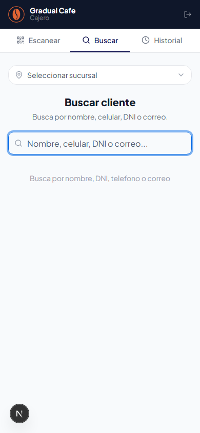
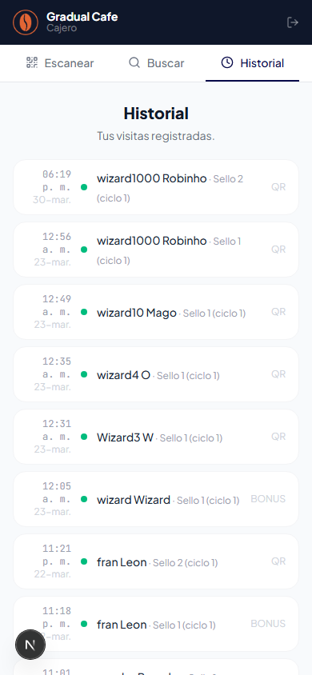

# Manual de Usuario — Cajero

> **Plataforma**: Cuik — Fidelizacion wallet-native para comercios fisicos
> **Rol**: Cajero (usuario operativo — escanea QR, registra visitas, canjea premios)
> **Ultima actualizacion**: 2026-03-30

---

## Indice

1. [Registro e ingreso](#1-registro-e-ingreso)
2. [Vista general del cajero](#2-vista-general-del-cajero)
3. [Escanear QR](#3-escanear-qr-cajeroescanear)
4. [Buscar cliente](#4-buscar-cliente-cajerobuscar)
5. [Historial](#5-historial-cajerohistorial)
6. [Flujo tipico del dia a dia](#6-flujo-tipico-del-dia-a-dia)
7. [Como funciona la fidelizacion](#7-como-funciona-la-fidelizacion)
8. [Preguntas frecuentes](#8-preguntas-frecuentes)

---

## 1. Registro e ingreso

### Recibir invitacion

El administrador de tu comercio te envia una invitacion por email. El correo contiene un link para unirte al sistema.

### Crear tu cuenta

1. Abre el link de invitacion en tu correo
2. Completa el formulario de registro:
   - **Nombre completo**
   - **Contrasena**: minimo 8 caracteres, debe incluir al menos una mayuscula y un numero
   - **Confirmar contrasena**
3. Haz clic en **"Crear cuenta"**
4. Tu cuenta se vincula automaticamente al comercio que te invito

### Iniciar sesion

1. Ve a la URL de login (la misma que usa el admin)
2. Ingresa tu **email** y **contrasena**
3. Haz clic en **"Iniciar sesion"**
4. El sistema te redirige automaticamente a `/cajero/escanear` (la pantalla de escaneo)

> **Nota**: Si olvidaste tu contrasena, pidele al administrador que la resetee desde el panel de Cajeros. Recibiras una contrasena temporal.

---

## 2. Vista general del cajero

La interfaz del cajero esta disenada para uso en celular, con 3 pantallas principales accesibles desde las tabs inferiores.

### Encabezado

- **Logo** de Cuik
- **Nombre del comercio** (ejemplo: "Mascota Veloz")
- **Badge "Cajero"** que indica tu rol
- **Reloj** en formato HH:MM con la hora actual
- **Boton de cerrar sesion** (icono de flecha a la derecha)

### Tabs de navegacion

| Tab | Icono | Funcion |
|-----|-------|---------|
| **Escanear** | QR Code | Escanear QR del cliente para registrar visita |
| **Buscar** | Lupa | Buscar clientes por nombre, celular o DNI |
| **Historial** | Reloj | Ver las visitas que registraste |

El tab activo se resalta con un borde azul inferior.

### Seleccion de sucursal

Si el comercio tiene sucursales configuradas, **debes seleccionar una sucursal antes de registrar visitas**. La seleccion de sucursal aparece como un boton desplegable en la parte superior de las pantallas de Escanear y Buscar.

- Si solo hay una sucursal, se selecciona automaticamente
- Si hay varias, el sistema recuerda tu ultima seleccion
- **IMPORTANTE**: No podras registrar visitas sin una sucursal seleccionada (si el comercio las tiene configuradas)

<!-- TODO: capture screenshot for selector de sucursal desplegado -->

---

## 3. Escanear QR (`/cajero/escanear`)

Esta es tu pantalla principal de trabajo. Aqui escaneas el codigo QR que el cliente muestra desde su celular (Apple Wallet o Google Wallet).

### Escanear con la camara

1. La camara se activa automaticamente al abrir la pantalla
2. Apunta la camara al **QR del cliente** (que lo muestra desde su wallet)
3. El sistema lee el QR automaticamente

### Ingresar codigo manual

Si la camara no funciona o el QR no se lee:

1. Toca el boton **"Ingresar codigo manual"** (icono de teclado)
2. Escribe el codigo QR completo (formato: `cuik:slug:abc123def456`)
3. Presiona **Enter** o el boton de enviar

Para volver a la camara, toca **"Usar camara"**.

---

### Flujo para Sellos (Stamps)

Despues de escanear el QR:

#### Visita registrada con exito

Se muestra una pantalla verde con:

- Icono de check verde
- **"Visita registrada!"**
- Nombre del cliente
- **Barra de sellos**: circulos azules (sellos obtenidos) y transparentes (sellos faltantes)
- Texto "Sello X/Y - Ciclo Z"

<!-- TODO: capture screenshot for pantalla de visita exitosa con barra de sellos -->

Si el cliente tiene **premios pendientes** de canjear, aparece un banner ambar con el icono de regalo y un boton **"Canjear"**.

#### Ciclo completado — Premio ganado

Cuando el cliente llega al ultimo sello (ejemplo: sello 10 de 10), se muestra una **pantalla especial de celebracion**:

- Icono de estrella dorada
- **"Premio ganado!"**
- Nombre del cliente
- Badge con el valor del premio

Tienes dos opciones:

| Boton | Accion |
|-------|--------|
| **"Confirmar canje"** | Canjea el premio inmediatamente. El cliente empieza un nuevo ciclo |
| **"Canjear despues"** | El premio queda pendiente. El cliente puede canjearlo en su proxima visita |

<!-- TODO: capture screenshot for pantalla de premio ganado con botones de canje -->

#### Ya fue escaneado hoy

Si el cliente ya fue escaneado hoy, se muestra:

- Icono de check ambar
- **"Ya fue escaneado hoy"**
- Los sellos actuales del cliente (sin cambios)
- Si tiene premios pendientes, aparece el banner ambar con opcion de canjear

> **Nota**: Cada cliente solo puede ser escaneado una vez por dia. Esto es automatico y no se puede omitir.

#### Errores

| Error | Causa |
|-------|-------|
| "QR no valido — formato incorrecto" | El QR no tiene el formato esperado (no empieza con `cuik:`) |
| "Cliente no encontrado en este comercio" | El QR corresponde a un cliente de otro comercio o no existe |
| "No hay promocion activa en este comercio" | El admin no tiene una promocion configurada |
| "Error de conexion — intenta de nuevo" | Problema de internet. Verifica tu conexion |

En caso de error, toca **"Intentar de nuevo"** para volver a escanear.

---

### Flujo para Puntos (Points)

Si el comercio tiene una promocion de **puntos** activa, el flujo es diferente:

1. Escanea el QR del cliente
2. Se muestra una pantalla pidiendo **ingresar el monto de la compra** (en la moneda local, ejemplo: S/)
3. Ingresa el monto y confirma
4. Se muestran los resultados:
   - **Puntos ganados**: "+X puntos"
   - **Balance total**: puntos acumulados del cliente
   - Si hubo un **multiplicador** activo (dia especial, hora feliz, cumpleanos), se muestra

<!-- TODO: capture screenshot for pantalla de ingreso de monto para puntos -->

### Boton "Nuevo escaneo"

Despues de cualquier resultado (exito, ya escaneado, premio, error), toca **"Nuevo escaneo"** para volver a la pantalla de la camara y escanear otro cliente.

---

## 4. Buscar cliente (`/cajero/buscar`)

Permite buscar un cliente por nombre, celular o DNI para ver su estado o registrar una visita sin necesidad de escanear QR.

### Como buscar

1. Escribe en el campo de busqueda (nombre, numero de celular o DNI)
2. Los resultados aparecen automaticamente despues de un breve retraso
3. Cada resultado muestra:
   - Avatar con la inicial del nombre
   - Nombre completo
   - Telefono o DNI
   - Total de visitas
   - Badge de segmento: Nuevo (azul), Regular (verde), VIP (ambar)

### Ver detalle del cliente

Toca un cliente de la lista para ver su detalle completo:

#### Para Sellos:

Una tarjeta azul con:

- Nombre y telefono
- Visitas totales
- **Sellos actuales** (ejemplo: 3/10)
- **Premios pendientes** (si tiene)

#### Para Puntos:

Una tarjeta azul con:

- Nombre y telefono
- Visitas totales
- **Balance de puntos**
- **Catalogo de items canjeables** con costo en puntos

<!-- TODO: capture screenshot for detalle de cliente en busqueda con tarjeta azul -->

### Registrar visita desde busqueda

1. En el detalle del cliente, toca el boton **"Registrar visita"** (boton azul con icono de check)
2. **Para sellos**: la visita se registra directamente
3. **Para puntos**: se pide ingresar el monto de la compra
4. Se muestra el resultado: "Visita registrada!", "Ya fue escaneado hoy", etc.
5. Los datos del cliente se actualizan automaticamente

### Canjear premio desde busqueda

Si el cliente tiene premios pendientes (sellos) o puntos suficientes para un item del catalogo (puntos):

1. Aparece un banner ambar con el boton **"Canjear"**
2. Toca "Canjear" para ejecutar el canje
3. Se muestra **"Premio canjeado!"** y los datos se refrescan

### Volver a buscar

Toca **"Nueva busqueda"** para limpiar la seleccion y volver al buscador.

---

## 5. Historial (`/cajero/historial`)

Muestra las visitas que **tu** registraste. Solo ves tus propias visitas, no las de otros cajeros.

### Que muestra cada visita

| Dato | Formato |
|------|---------|
| **Hora** | HH:MM (hora local) |
| **Fecha** | DD Mes (ejemplo: 14 mar) |
| **Nombre del cliente** | Nombre completo |
| **Sello y ciclo** | "Sello X (ciclo Y)" |
| **Fuente** | Badge en uppercase (QR, MANUAL, etc.) |

Las visitas se muestran de la mas reciente a la mas antigua.

### Paginacion

Si tienes mas de 20 visitas registradas, aparecen controles de paginacion:

- **Boton anterior** (flecha izquierda)
- **"Pagina X de Y"** en el centro
- **Boton siguiente** (flecha derecha)

### Estado vacio

Si aun no registraste ninguna visita, se muestra un icono de reloj con el mensaje **"Aun no has registrado visitas"**.

---

## 6. Flujo tipico del dia a dia

Este es el flujo que seguiras en tu trabajo diario:

### Paso 1 — Abrir la app

1. Abre el navegador en tu celular
2. Ve a la URL del sistema (guardala como favorito o acceso directo en tu pantalla de inicio)
3. Si tu sesion sigue activa, entraras directo a la pantalla de escaneo
4. Si no, ingresa tus credenciales

### Paso 2 — Seleccionar sucursal

Si tu comercio tiene sucursales:
1. Toca el selector de sucursal en la parte superior
2. Elige la sucursal donde estas trabajando hoy
3. La seleccion se recuerda para la proxima vez

### Paso 3 — Atender al cliente

1. El cliente llega a la caja
2. Le pides que muestre su **QR del wallet** (abre Apple Wallet o Google Wallet y muestra la tarjeta)
3. **Apuntas la camara** de tu celular al QR
4. El sistema lee automaticamente el QR

### Paso 4 — Confirmar la visita

**Para sellos:**
- Se muestra "Visita registrada!" con los sellos actualizados
- Si completo el ciclo, decides si canjear el premio ahora o despues

**Para puntos:**
- Ingresas el monto de la compra
- Se calculan y muestran los puntos ganados

### Paso 5 — Siguiente cliente

Toca **"Nuevo escaneo"** y repite el proceso.

### Si el QR no funciona

1. Toca **"Ingresar codigo manual"**
2. Pide al cliente que te muestre el codigo escrito en su pase (parte trasera)
3. Escribelo manualmente

### Si el cliente no tiene su celular

1. Ve al tab **"Buscar"**
2. Busca al cliente por nombre, celular o DNI
3. Registra la visita desde ahi

---

## 7. Como funciona la fidelizacion

### Promocion de Sellos (Stamps)

1. Cada comercio tiene una promocion con un numero maximo de sellos (ejemplo: 10)
2. Cada visita = 1 sello
3. Al completar todos los sellos (ejemplo: 10/10), se genera un **premio automaticamente**
4. El premio se puede canjear inmediatamente o guardarse para despues
5. Despues del canje, empieza un **nuevo ciclo** desde sello 1
6. **Limite**: un escaneo por cliente por dia

### Promocion de Puntos (Points)

1. Cada visita requiere ingresar el **monto de la compra**
2. El sistema calcula los puntos segun una formula configurada por el comercio
3. Pueden haber **multiplicadores** activos (dia especial, hora feliz, cumpleanos del cliente)
4. El cliente acumula puntos y los canjea por **items del catalogo de recompensas**
5. El cajero puede canjear items desde la pantalla de Buscar si el cliente tiene puntos suficientes

### Que pasa con el wallet del cliente?

Despues de cada visita o canje, el pase digital del cliente **se actualiza automaticamente** en su Apple Wallet o Google Wallet. No necesitas hacer nada extra — el sistema envia la actualizacion.

---

## 8. Preguntas frecuentes

### La camara no funciona, que hago?

Usa el modo **"Ingresar codigo manual"**. Si la camara sigue sin funcionar, verifica que le diste permisos de camara al navegador (aparece un popup la primera vez).

### El cliente dice que su QR no es valido

Verifica que:
1. El cliente este registrado en **tu** comercio (no en otro)
2. El QR empiece con `cuik:` — si no, no es un QR de Cuik
3. El celular del cliente tenga la pantalla con brillo suficiente para que la camara lo lea

### Puedo escanear al mismo cliente dos veces en un dia?

No. El sistema lo detecta automaticamente y muestra "Ya fue escaneado hoy". Esto es una proteccion del sistema y no se puede omitir.

### El cliente completo su ciclo pero no quiere canjear ahora

Sin problema. Toca **"Canjear despues"**. El premio queda guardado como "pendiente" y podra canjearlo en su proxima visita. Cuando vuelva, veras el banner ambar con la opcion de canjear.

### No puedo registrar visitas, dice "Selecciona una sucursal"

Si el comercio tiene sucursales configuradas, **debes seleccionar una** antes de poder escanear. Toca el selector de sucursal en la parte superior de la pantalla.

### Como cierro sesion?

Toca el icono de **flecha/logout** en la esquina superior derecha del encabezado. Seras redirigido a la pantalla de login.

### Puedo ver las visitas de otros cajeros?

No. En el historial solo ves las visitas que **tu** registraste. El administrador del comercio puede ver todas las visitas desde su panel.

### Que pasa si se va el internet mientras escaneo?

El sistema muestra un error de conexion. Espera a que vuelva la conexion y toca "Intentar de nuevo". La visita no se registro, asi que puedes reintentar sin riesgo de duplicar.
