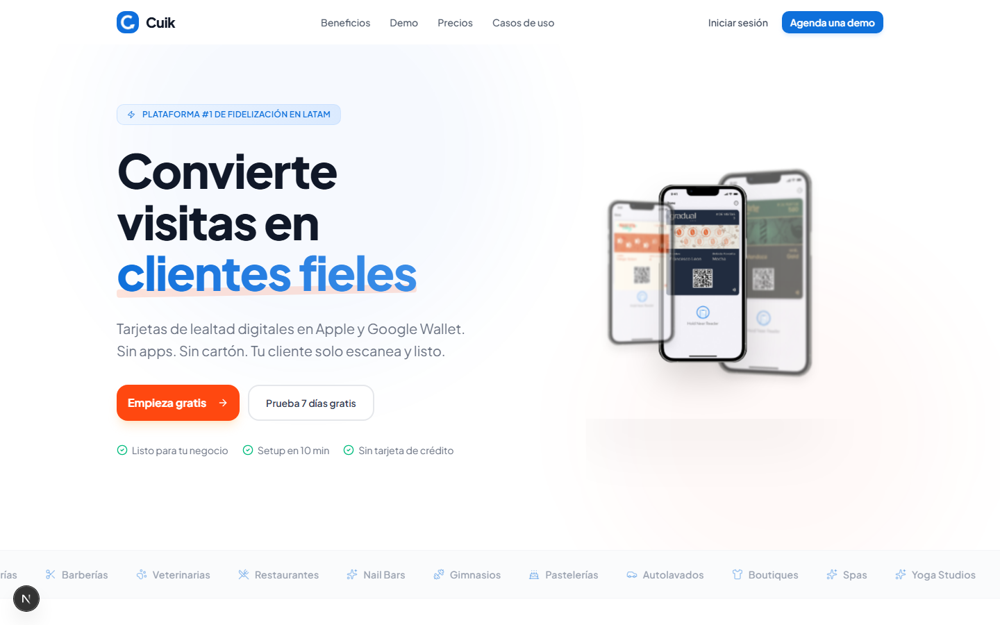
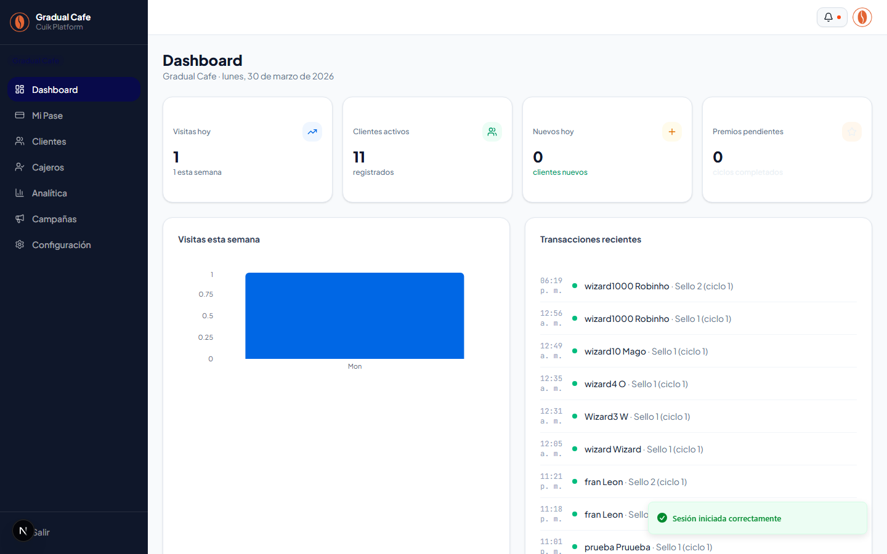
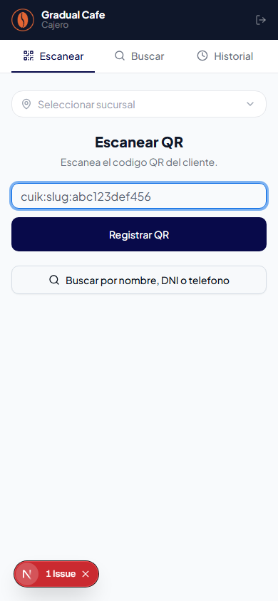
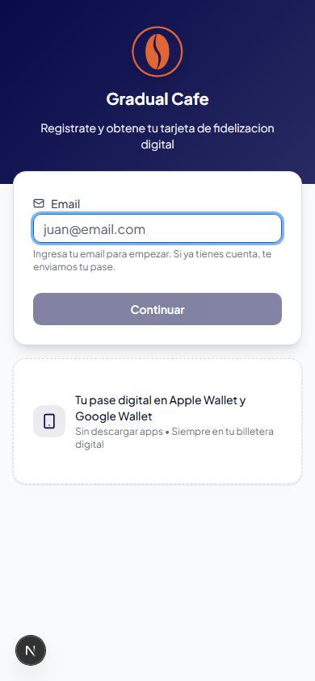

# Manual Completo de Cuik — Plataforma de Fidelizacion

> Guia de referencia general que integra todos los roles, flujos y funcionalidades de la plataforma.
> Ultima actualizacion: 2026-03-30

---

## 1. Introduccion

### Que es Cuik?

Cuik es una plataforma de fidelizacion digital para comercios fisicos en Latinoamerica. Reemplaza las clasicas tarjetitas de sellos de carton por **pases digitales que viven directamente en Apple Wallet y Google Wallet**. El cliente no necesita descargar ninguna app.

El funcionamiento es simple: un cliente entra al local, el cajero le escanea un QR, y automaticamente se le suman sellos o puntos a su pase digital. Cuando completa el objetivo, gana un premio que puede canjear en el momento.

### Para quien es?

- **Comercios fisicos**: cafeterias, barberias, veterinarias, restaurantes, gimnasios, tiendas de ropa — cualquier negocio con clientes recurrentes.
- **Clientes finales**: los consumidores que visitan esos comercios y quieren acumular beneficios.

### Modelo de operacion

Cuik **no es un SaaS donde el comercio se registra solo**. La plataforma es operada manualmente por el equipo de Cuik (el Super Admin):

1. El comercio muestra interes a traves de un formulario (solicitud/lead)
2. El Super Admin revisa, aprueba y configura todo: pase, branding, promocion
3. El comercio recibe sus credenciales para acceder al panel
4. El cobro es externo (transferencia, Yape, etc.) — la app solo activa o desactiva planes

---

## 2. Arquitectura de Roles

Cuik tiene cuatro roles con distintos niveles de acceso. Cada rol tiene su propia interfaz optimizada para sus tareas.

| Rol | Quien es | Donde accede | Que puede hacer |
|-----|----------|--------------|-----------------|
| **Super Admin** | El equipo de Cuik | `/admin/*` | Todo: crear comercios, configurar promociones, disenar pases, gestionar planes, metricas globales |
| **Admin del comercio** | Dueno o gerente | `/panel/*` | Su tenant: ver KPIs, gestionar cajeros, ver clientes, enviar campanas push, ver analitica |
| **Cajero** | Empleado del mostrador | `/cajero/*` | Escanear QR, buscar clientes, registrar visitas, canjear premios |
| **Cliente final** | El consumidor | `/:slug/registro` | Registrarse, acumular sellos/puntos, ver premios, canjear recompensas |

### Permisos y seguridad

- Las **organizaciones** de Better Auth representan tenants (1:1).
- El admin es el owner de la organizacion, los cajeros son members.
- Las rutas estan protegidas por middleware: cada rol solo puede acceder a su area.
- El `tenant_id` nunca se confia del cliente — siempre se deriva de la sesion autenticada.

---

## 3. Flujo Completo End-to-End

Este es el camino desde que un comercio muestra interes hasta que esta operando con clientes:

### Paso 1 — Solicitud

El comercio llega a la landing de Cuik y completa un formulario con los datos de su negocio (nombre, tipo, ciudad, contacto). Esto crea una **solicitud** que queda pendiente.

### Paso 2 — Aprobacion por el Super Admin

El SA entra a `/admin/solicitudes`, revisa las solicitudes pendientes, y al aprobar una se crean automaticamente:

- Un **tenant** (la entidad del comercio en el sistema)
- Una **organizacion** (para manejar usuarios y roles)
- Un **usuario admin** con credenciales temporales
- Una **promocion default** de tipo sellos (creada como inactiva)
- Un **diseno de pase borrador** vinculado a la promocion
- **Assets default** del pase (icono, strip, stamp)

<!-- Screenshot sa-02-solicitudes.png pendiente de captura -->

### Paso 3 — Configuracion por el Super Admin

El SA configura el comercio:

1. **Promocion**: Activa la promocion default o crea una nueva (sellos o puntos), configura reglas y premios
2. **Registro**: Define que datos pedirle a los clientes (campos basicos + estrategicos)
3. **Pase de wallet**: Disena el pase en el editor visual (puede usar IA para generar el diseno completo)
4. **Branding**: Configura colores y logo para el panel web y la pagina de registro
5. **Publicacion**: Publica el pase (solo si la promocion esta activa)

<!-- Screenshot sa-07-pases.png pendiente de captura -->

### Paso 4 — El comercio recibe credenciales

El SA envia las credenciales al comercio. El admin entra a `/login`, inicia sesion, y ve su panel en `/panel`.

### Paso 5 — Configuracion por el Admin

El admin configura su operacion:

- Invita cajeros desde `/panel/cajeros` (por email)
- Agrega sucursales/ubicaciones
- Revisa su pase en `/panel/mi-pase`

### Paso 6 — Registro de clientes

El admin comparte el link de registro (`/:slug/registro`) con sus clientes, ya sea via QR code en el mostrador, redes sociales, o directamente.

### Paso 7 — Operacion diaria

- El cajero escanea QR de clientes → registra visitas → los sellos/puntos se suman automaticamente
- El pase del cliente se actualiza en su wallet via push notification
- Cuando el cliente completa un ciclo, el cajero puede canjear el premio en el momento

### Paso 8 — Campanas y analitica

- El admin envia campanas push segmentadas a sus clientes
- Revisa metricas de visitas, retencion, y top clientes en la analitica

---

## 4. Tipos de Promocion

Cada comercio puede tener multiples promociones creadas, pero **solo una puede estar activa a la vez**. Al activar una, se desactivan automaticamente las demas. Las promociones siempre se crean como **inactivas** — el SA las activa manualmente.

### 4.1 Sellos (Stamps)

**Mecanica**: El cliente acumula sellos con cada visita. Cuando completa el numero configurado (ejemplo: 10 visitas), gana un premio.

1. El cajero escanea el QR del cliente
2. Se le suma un sello al pase
3. Al completar el ciclo (ejemplo: sello 10 de 10), se genera un premio automaticamente
4. El cajero puede canjear el premio en el momento, o el cliente lo guarda para despues
5. Despues del canje, empieza un nuevo ciclo desde sello 1

**Reglas configurables**:

| Regla | Que hace | Ejemplo |
|-------|----------|---------|
| Max visitas por dia | Limita sellos por dia | Max 1 visita/dia |
| Sello doble | Dias/horarios con doble sello | Martes 14:00-17:00: 2x |
| Bonus de cumpleanos | Multiplicador el dia del cumpleanos | Cumpleanos: 3x sellos |
| Monto minimo | Solo otorga sello si supera un monto | Minimo S/ 15 |
| Restriccion por sede | Solo en ubicaciones especificas | Solo sucursal Centro |
| Expiracion de sellos | Los sellos pueden expirar | 6 meses o 2 meses de inactividad |
| Expiracion de premios | Fecha limite para canjear | 30 dias desde que se genero |

### 4.2 Puntos (Points)

**Mecanica**: El cliente acumula puntos segun cuanto gasta. Los canjea por items de un catalogo de recompensas.

1. El cajero escanea el QR del cliente
2. El cajero ingresa el **monto de la compra**
3. El sistema calcula los puntos: `puntos = monto x puntosPerCurrency`
4. Los puntos se suman al balance del cliente
5. El cliente canjea items del catalogo cuando tiene puntos suficientes

**Configuracion de puntos**:

| Configuracion | Que hace | Ejemplo |
|---------------|----------|---------|
| Puntos por unidad monetaria | Puntos ganados por cada S/ gastado | 1 pt por S/ 1 |
| Metodo de redondeo | Como redondear fracciones | Piso, redondeo o techo |
| Monto minimo | Solo otorga puntos si supera un monto | Minimo S/ 10 |
| Multiplicadores | Dias/horarios con puntos multiplicados | Sabados 12:00-15:00: 2x |
| Multiplicador de cumpleanos | Puntos extra el dia del cumpleanos | Cumpleanos: 3x |
| Bonus de registro | Puntos al registrarse | +50 puntos |
| Expiracion | Los puntos pueden expirar | 12 meses |

**Catalogo de recompensas**: Items canjeables con nombre, descripcion, imagen, costo en puntos y categoria. Los clientes pueden verlo en la pagina publica `/:slug/premios`.

### Tiers automaticos

El sistema clasifica clientes segun sus visitas totales:

| Tier | Rango | Descripcion |
|------|-------|-------------|
| Nuevo | 0-4 visitas | Recien registrado |
| Frecuente | 5-19 visitas | Cliente regular |
| VIP | 20+ visitas | Cliente leal |

Los tiers son configurables (nombre, rango) y pueden desactivarse.

---

## 5. Super Admin — Panel de Administracion (`/admin/*`)

El Super Admin opera toda la plataforma. Para la guia detallada, ver [Manual del Super Admin](SUPER_ADMIN.md).

### Resumen de secciones

| Seccion | Ruta | Funcion |
|---------|------|---------|
| Solicitudes | `/admin/solicitudes` | Bandeja de entrada: aprobar o rechazar solicitudes de comercios |
| Tenants | `/admin/tenants` | Gestion de comercios: KPIs, promociones, registro, edicion |
| Disenos de Pases | `/admin/pases` | Crear y editar pases de wallet con editor visual + IA |
| Branding | `/admin/branding` | Configurar identidad visual web de cada comercio |
| Planes | `/admin/planes` | Gestion de planes de suscripcion |
| Metricas | `/admin/metricas` | Dashboard con metricas globales de la plataforma |
| Configuracion | `/admin/configuracion` | Parametros globales (nombre, URL, email soporte, dias de trial) |

### Flujos clave del SA

**Aprobar solicitud**: Solicitudes > Click "Aprobar" > Se generan credenciales + tenant + promocion + pase borrador > Copiar credenciales y enviar al comercio.

**Configurar tenant**: Tenants > Click en ojo > Tab "Promocion" (activar/configurar reglas) > Tab "Registro" (campos + bonus marketing) > Tab "Editar" (datos basicos).

**Disenar y publicar pase**: Pases > "Editar" (o crear nuevo) > Editor visual (colores, imagenes, campos con variables de template) > Guardar > Publicar (requiere promocion activa).

**Generar diseno con IA**: En el editor visual > Click "Generar con IA" > Se generan assets (logo, strip, stamp) y se configuran campos automaticamente segun el tipo de promocion.

---

## 6. Admin del Comercio — Panel de Gestion (`/panel/*`)

El admin es el dueno o gerente del negocio. No puede editar pases ni configurar promociones — eso lo hace el SA. Para la guia detallada, ver [Manual del Admin](ADMIN_TENANT.md).

### Resumen de secciones

| Seccion | Ruta | Funcion |
|---------|------|---------|
| Dashboard | `/panel` | KPIs del dia, grafico de visitas semanales, ultimas transacciones |
| Mi Pase | `/panel/mi-pase` | Preview del pase, reglas de promocion, catalogo (solo lectura) |
| Clientes | `/panel/clientes` | Lista de clientes, busqueda, detalle, notas CRM, tags, exportar CSV |
| Cajeros | `/panel/cajeros` | Invitar cajeros por email, ver estadisticas, eliminar miembros |
| Analitica | `/panel/analitica` | KPIs avanzados, graficos de visitas, heatmap de retencion, top clientes |
| Campanas | `/panel/campanas` | Crear y enviar notificaciones push segmentadas via wallet |
| Configuracion | `/panel/configuracion` | Editar datos del comercio, ver plan actual |

### Flujos clave del Admin

**Ver estado del negocio**: Dashboard > KPIs del dia (visitas hoy, clientes activos, nuevos, premios pendientes) + grafico semanal + ultimas transacciones.

**Gestionar clientes**: Clientes > Buscar por nombre/DNI/celular > Click para ver detalle > Tabs: Informacion, Notas, Tags, Comunicaciones.

**Invitar cajero**: Cajeros > "Invitar cajero" > Ingresar email > Se envia invitacion real.

**Enviar campana push**: Campanas > "Nueva campana" > Escribir mensaje > Elegir segmento (Todos, VIP, Nuevos, etc.) > Enviar o programar.

**Compartir link de registro**: Clientes > "Pagina de registro" > Copiar URL `/:slug/registro` > Compartir con clientes.

---

## 7. Cajero — Panel de Operacion (`/cajero/*`)

El cajero tiene la interfaz mas simple. Tres pantallas, todo pensado para operar rapido desde celular o tablet. Para la guia detallada, ver [Manual del Cajero](CAJERO.md).

### Resumen de secciones

| Seccion | Ruta | Funcion |
|---------|------|---------|
| Escanear | `/cajero/escanear` | Escanear QR de clientes, registrar visitas, canjear premios |
| Buscar | `/cajero/buscar` | Buscar cliente por nombre/DNI/celular, ver detalle, registrar visita manual |
| Historial | `/cajero/historial` | Historial de visitas registradas por el cajero actual |

### Flujo de escaneo (Sellos)

1. Apunta la camara al QR del cliente (formato `cuik:slug:codigo`)
2. Se registra la visita automaticamente
3. Pantalla de exito: nombre del cliente + barra visual de sellos
4. Si se completa el ciclo: pantalla de celebracion con "Premio ganado!" y opciones "Canjear ahora" o "Canjear despues"
5. Si ya fue escaneado hoy: aviso ambar "Ya fue escaneado hoy"

### Flujo de escaneo (Puntos)

1. Apunta la camara al QR del cliente
2. Se pide **ingresar el monto de la compra** (input en S/)
3. Al confirmar, se calculan y suman los puntos
4. Se muestran los puntos ganados (+X) y el balance total
5. Si hubo multiplicador o bonus, se muestra detalle

### Busqueda y operacion manual

Si la camara no funciona o el cliente no tiene su QR a mano:
- "Ingresar codigo manual" para escribir el codigo QR
- "Buscar por nombre, DNI o telefono" para encontrar al cliente
- Desde la busqueda: registrar visita, ver detalle, canjear premios

---

## 8. Cliente Final — Experiencia de Usuario

El cliente final es el consumidor que visita el comercio. Para la guia detallada, ver [Manual del Usuario Final](USUARIO_FINAL.md).

### Registro (`/:slug/registro`)

Flujo email-first:
1. El cliente ingresa su email
2. Si ya tiene cuenta, recibe un email con link a su pase existente
3. Si es nuevo, completa el formulario con sus datos
4. Al registrarse, es redirigido a la pagina de bienvenida

**Campos basicos**: Nombre, apellido, DNI, telefono, email.
**Campos estrategicos**: Configurados por el SA segun el comercio (bebida favorita, cumpleanos, sucursal preferida, etc.).
**Bonus de marketing**: Si acepta recibir promos, puede ganar sellos o puntos extra.

### Bienvenida (`/:slug/bienvenido`)

Pagina post-registro con:
- Saludo personalizado ("Bienvenido/a, Juan!")
- Preview del pase de fidelizacion (wallet preview real)
- Botones para agregar a Apple Wallet y Google Wallet (adaptados al dispositivo)
- Link al catalogo de premios (si el comercio usa puntos)
- Instrucciones de "Como funciona" (3 pasos: visita, mostra tu pase, acumula y gana)

<!-- Screenshot de pantalla de bienvenida pendiente de captura -->

### Catalogo de premios (`/:slug/premios`)

Solo disponible para comercios con promocion de puntos. Pagina publica con:
- Header con branding del comercio
- Cards de items canjeables agrupados por categoria
- Cada item muestra: imagen, nombre, descripcion, costo en puntos

### Uso diario

1. Abri tu wallet en el celular
2. Mostra el QR al cajero
3. El cajero lo escanea y tu pase se actualiza automaticamente
4. Cuando completaste los sellos o tenes puntos suficientes, canjeas tu premio

---

## 9. Variables de Template para Pases

Los pases de wallet tienen campos configurables con informacion dinamica. Estas variables se usan en el editor de pases.

### Variables de cliente

| Variable | Que muestra | Ejemplo |
|----------|-------------|---------|
| `{{client.name}}` | Nombre | "Juan" |
| `{{client.lastName}}` | Apellido | "Perez" |
| `{{client.phone}}` | Telefono | "+51 999 999 999" |
| `{{client.email}}` | Email | "juan@email.com" |
| `{{client.tier}}` | Tier actual | "VIP" |
| `{{client.totalVisits}}` | Total de visitas | "25" |
| `{{client.birthday}}` | Cumpleanos | "1990-05-15" |
| `{{client.pointsBalance}}` | Balance de puntos | "350" |
| `{{client.customData.clave}}` | Dato estrategico | "Americano" |

### Variables de sellos

| Variable | Que muestra | Ejemplo |
|----------|-------------|---------|
| `{{stamps.current}}` | Sellos en el ciclo actual | "7" |
| `{{stamps.max}}` | Sellos totales del ciclo | "10" |
| `{{stamps.remaining}}` | Sellos que faltan | "3" |
| `{{stamps.total}}` | Visitas totales acumuladas | "37" |

### Variables de puntos

| Variable | Que muestra | Ejemplo |
|----------|-------------|---------|
| `{{points.balance}}` | Balance actual de puntos | "350" |

### Variables de premios y tenant

| Variable | Que muestra | Ejemplo |
|----------|-------------|---------|
| `{{rewards.pending}}` | Premios pendientes | "2" |
| `{{tenant.name}}` | Nombre del comercio | "Mascota Veloz" |

**Uso**: En el editor, se configuran campos del pase (headerFields, secondaryFields, backFields) usando estas variables. Ejemplo: Label "PUNTOS", Valor `{{points.balance}}`.

---

## 10. Apple Wallet — Como Funciona

Apple Wallet usa archivos `.pkpass` con el diseno, datos y firma digital del pase.

**Flujo**:
1. Al registrarse, el cliente recibe un link para descargar su pase (.pkpass)
2. Lo agrega a Apple Wallet con un tap
3. Cada visita registrada envia una push notification via APNs
4. Apple Wallet descarga la version actualizada automaticamente
5. El cliente ve los sellos/puntos actualizados

**Web Service Protocol**: El pase contiene una URL de servicio web que Apple Wallet usa para registrar/desregistrar dispositivos y obtener actualizaciones. Funciona automaticamente.

---

## 11. Google Wallet — Como Funciona

Google Wallet usa "Loyalty Objects" creados y actualizados via la API de Google.

**Flujo**:
1. Al registrarse, el cliente recibe un link "Save to Google Wallet" firmado con JWT
2. Al hacer click, el pase se agrega a Google Wallet
3. Cada visita registrada actualiza el Loyalty Object via la API de Google
4. El pase se actualiza automaticamente

---

## 12. Campanas Push

Los admins pueden enviar notificaciones push a los clientes de su comercio directamente a traves de los pases de wallet.

### Crear una campana

1. Ir a `/panel/campanas` > "Nueva campana"
2. Escribir el mensaje (titulo + cuerpo)
3. Elegir segmento de destinatarios:
   - **Todos**: Todos los clientes del comercio
   - **Activos**: Clientes con visitas recientes
   - **Inactivos**: Clientes sin visitas en X tiempo
   - **VIP**: Clientes con tier VIP
   - **Nuevos**: Clientes registrados recientemente
   - **Personalizado**: Filtro por rango de visitas y/o fechas
4. Enviar inmediatamente o programar para una fecha futura

### Como llegan las notificaciones

- En **iPhone**: Push notification vinculada al pase de Wallet (aparece en pantalla de bloqueo)
- En **Android**: Notificacion via Google Wallet

---

## 13. Credenciales de Prueba

| Rol | Email | Password | URL de acceso |
|-----|-------|----------|---------------|
| Super Admin | `sa@cuik.app` | `password123` | `/admin/solicitudes` |
| Admin comercio | `admin@mascotaveloz.com` | `password123` | `/panel` |
| Cajero | `cajero@mascotaveloz.com` | `password123` | `/cajero/escanear` |

**Nota**: Credenciales del entorno de demo/desarrollo, pre-cargadas con `pnpm db:seed`.

---

## 14. Indice de Manuales

| Manual | Audiencia | Contenido |
|--------|-----------|-----------|
| [Manual del Super Admin](SUPER_ADMIN.md) | Equipo de Cuik | Gestion de solicitudes, tenants, pases, branding, planes, metricas |
| [Manual del Admin del Comercio](ADMIN_TENANT.md) | Dueno/gerente | Dashboard, clientes, cajeros, analitica, campanas push |
| [Manual del Cajero](CAJERO.md) | Empleados | Escanear QR, buscar clientes, registrar visitas, canjear premios |
| [Manual del Usuario Final](USUARIO_FINAL.md) | Consumidores | Registrarse, agregar a wallet, acumular sellos/puntos, ver premios |
| [Filosofia y Flujos](FILOSOFIA_Y_FLUJOS.md) | Referencia interna | Flujos detallados, decisiones de diseno, arquitectura |

---

## 15. Glosario

| Termino | Definicion |
|---------|------------|
| **Tenant** | La entidad que representa a un comercio dentro de Cuik. Cada comercio tiene un tenant con su propia configuracion, clientes, pases y metricas. |
| **Slug** | Identificador URL del tenant (ejemplo: `mascota-veloz`). Se usa en las rutas publicas como `/:slug/registro`. |
| **Pase** | La tarjeta de fidelizacion digital que vive en Apple Wallet o Google Wallet. Contiene sellos/puntos, QR code, y datos del cliente. |
| **Sello (Stamp)** | Unidad de progreso en promociones de tipo sellos. Se otorga uno por visita (o mas si hay reglas especiales). |
| **Ciclo** | Una ronda completa de sellos. Ejemplo: si el maximo es 10, un ciclo va del sello 1 al sello 10. Al completarlo, se genera un premio y empieza un nuevo ciclo. |
| **Punto (Point)** | Unidad de valor en promociones de tipo puntos. Se acumula segun el monto gastado y se canjea por items del catalogo. |
| **Promocion** | La mecanica de fidelizacion configurada para un comercio (sellos o puntos). Define las reglas, el objetivo, y los premios. |
| **Premio (Reward)** | Lo que gana el cliente al completar un ciclo de sellos o al canjear puntos. Puede ser un producto gratis, un descuento, etc. |
| **Campana** | Notificacion push masiva enviada a un segmento de clientes a traves de los pases de wallet. |
| **Tier** | Nivel de clasificacion del cliente segun sus visitas totales (Nuevo, Frecuente, VIP). |
| **SA (Super Admin)** | El operador de la plataforma Cuik. Tiene acceso total a todos los tenants y configuraciones. |
| **Campos estrategicos** | Campos personalizados que el SA configura en el formulario de registro de cada tenant (ejemplo: bebida favorita, cumpleanos, sucursal preferida). |
| **Motor de reglas** | Sistema que evalua las reglas de la promocion activa para determinar cuantos sellos/puntos otorgar, considerando multiplicadores, bonus, restricciones, etc. |
| **APNs** | Apple Push Notification Service. Servicio de Apple para enviar actualizaciones a los pases en Apple Wallet. |
| **Loyalty Object** | Entidad de la API de Google Wallet que representa un pase de fidelizacion. Se crea y actualiza via API. |
| **pkpass** | Formato de archivo de Apple Wallet. Contiene el diseno, datos y firma digital del pase. |
| **Variables de template** | Placeholders como `{{client.name}}` que se reemplazan con datos reales del cliente al generar o actualizar un pase. |
| **Branding** | Configuracion visual del comercio: colores primario y de acento, logo. Se aplica al panel web y a la pagina de registro. |

---

## 16. Flujo de Prueba Completo

### Fase 1 — Login y navegacion

1. Ir a `/login`
2. Seleccionar "Super Admin" (credenciales se precargan)
3. Click "Ingresar" > llegar a `/admin/solicitudes`
4. Navegar los 7 items del sidebar

### Fase 2 — Aprobar una solicitud

5. En `/admin/solicitudes`, aprobar una solicitud pendiente
6. Copiar credenciales generadas
7. Verificar tenant creado en `/admin/tenants`

### Fase 3 — Configurar el tenant

8. En `/admin/tenants`, buscar el tenant y abrir detalle
9. Tab "Promocion": verificar promocion default, configurar reglas, activar
10. Tab "Registro": agregar campos estrategicos, configurar bonus marketing
11. Tab "Editar": verificar edicion de datos

### Fase 4 — Disenar y publicar pase

12. En `/admin/pases`, verificar pase borrador creado automaticamente
13. Abrir editor visual, disenar (o generar con IA), guardar
14. Publicar (requiere promocion activa)

### Fase 5 — Registrar un cliente

15. Abrir `/:slug/registro` en otra pestana
16. Verificar branding del comercio
17. Ingresar email > completar formulario > aceptar terminos > enviar
18. Verificar redireccion a `/:slug/bienvenido` y botones de wallet

### Fase 6 — Probar como Admin

19. Login como admin > verificar `/panel` con KPIs
20. Navegar: Clientes, Cajeros, Analitica, Campanas, Mi Pase
21. Verificar cliente registrado en la lista

### Fase 7 — Probar como Cajero

22. Login como cajero > verificar `/cajero/escanear`
23. Escanear QR de un cliente (o usar codigo manual)
24. Verificar visita registrada y sellos/puntos actualizados
25. Intentar escanear de nuevo > "Ya fue escaneado hoy"
26. Buscar cliente > verificar detalle
27. Verificar historial

### Fase 8 — Probar puntos (si aplica)

28. Con promocion de puntos activa, escanear QR > ingresar monto
29. Verificar puntos calculados y balance
30. Probar canje de item del catalogo
31. Verificar `/:slug/premios` (pagina publica)

### Fase 9 — Verificar wallet

32. En dispositivo real, descargar pase desde bienvenida
33. Verificar que se agrega al wallet
34. Registrar visita y verificar que el pase se actualiza
