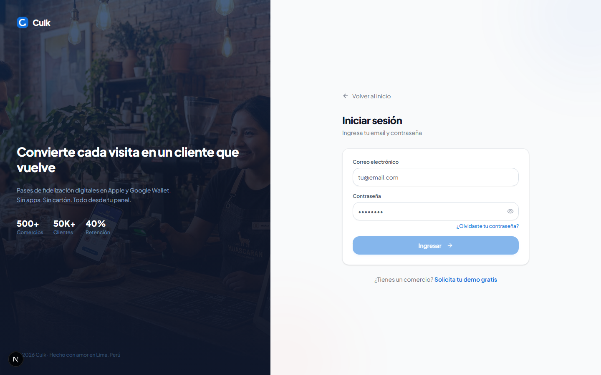
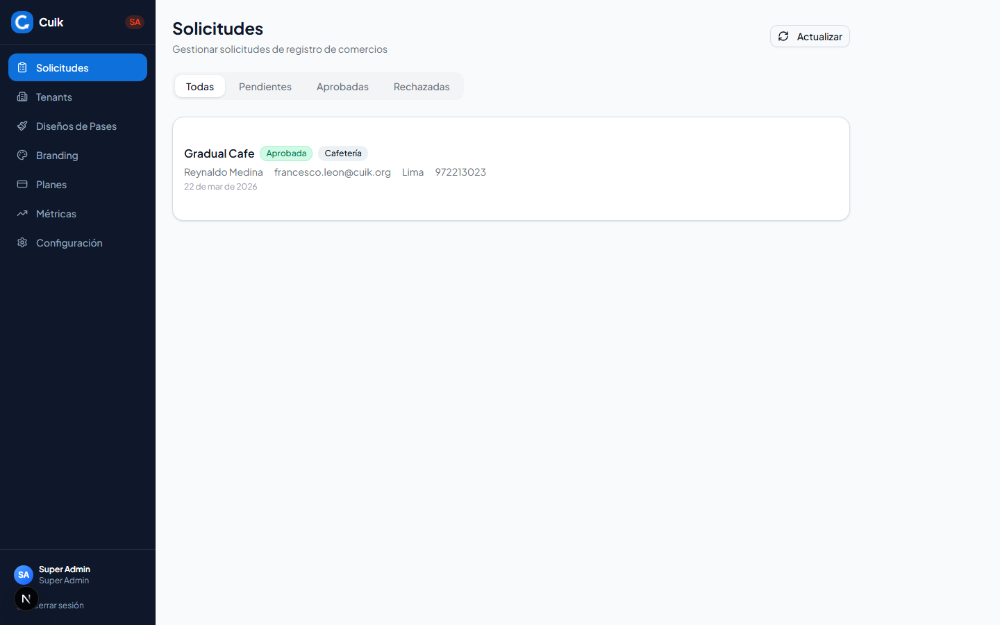
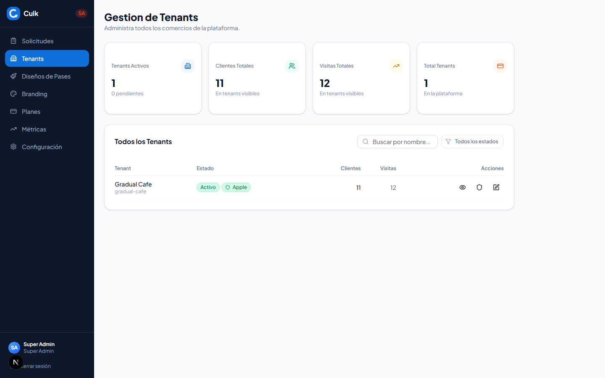
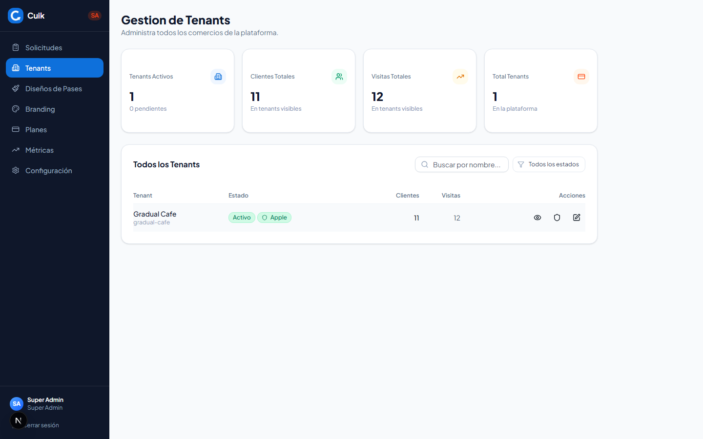
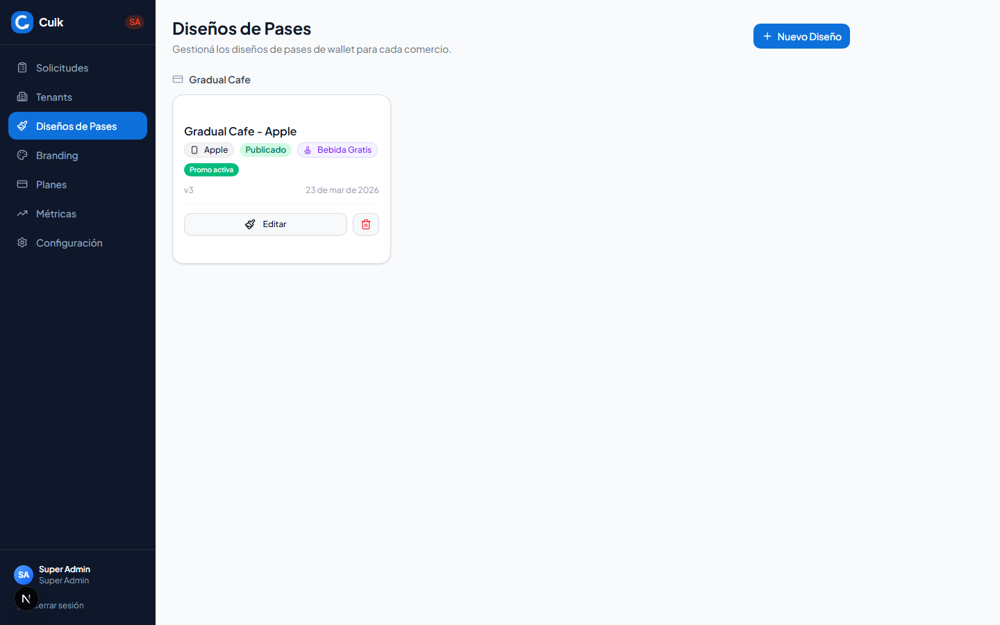
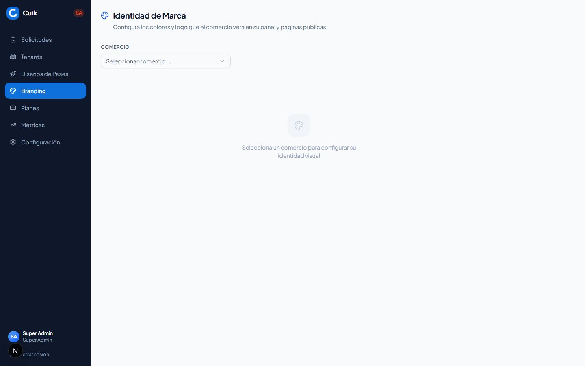
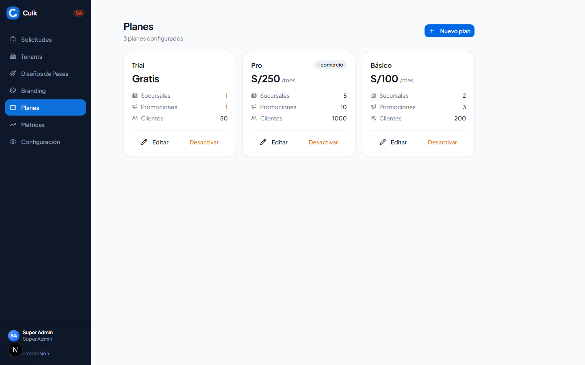
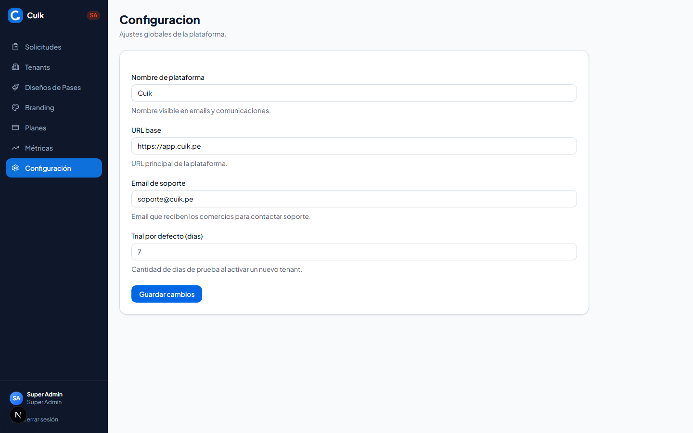

# Manual de Usuario — Super Admin (SA)

> Manual completo para el rol de Super Admin de la plataforma Cuik.
> Ultima actualizacion: 2026-03-30

---

## Tabla de Contenidos

1. [Acceso y Login](#1-acceso-y-login)
2. [Layout del Panel SA](#2-layout-del-panel-sa)
3. [Gestion de Solicitudes](#3-gestion-de-solicitudes)
4. [Gestion de Tenants](#4-gestion-de-tenants)
5. [Editor de Pases](#5-editor-de-pases)
6. [Branding](#6-branding)
7. [Planes](#7-planes)
8. [Metricas](#8-metricas)
9. [Configuracion](#9-configuracion)
10. [Wizard de Certificados Apple](#10-wizard-de-certificados-apple)
11. [Flujo Completo Paso a Paso](#11-flujo-completo-paso-a-paso)

---

## 1. Acceso y Login

### Credenciales

| Campo | Valor |
|---|---|
| **URL** | `/login` |
| **Email** | `sa@cuik.app` |
| **Password** | La contrasena configurada para la cuenta SA |

### Pasos

1. Ir a `/login` en el navegador.
2. Ingresar email y contrasena.
3. Al autenticarse, el sistema redirige automaticamente a `/admin/solicitudes` (pagina de inicio del SA).

### Que esperar

- Si las credenciales son correctas, carga el panel del SA con sidebar oscuro a la izquierda.
- Si las credenciales son incorrectas, se muestra un mensaje de error.
- Cualquier intento de acceder a rutas `/admin/*` sin sesion activa redirige al login.

---

## 2. Layout del Panel SA

El panel del SA tiene un layout fijo que se comparte en todas las pantallas.

### Sidebar (barra lateral izquierda)

- **Ancho fijo**: 224px (w-56)
- **Fondo**: `#0f172a` (azul oscuro)
- **Elementos**:
  - Logo de Cuik + texto "Cuik" + badge naranja "SA"
  - 7 items de navegacion:
    1. **Solicitudes** (`/admin/solicitudes`)
    2. **Tenants** (`/admin/tenants`)
    3. **Disenos de Pases** (`/admin/pases`)
    4. **Branding** (`/admin/branding`)
    5. **Planes** (`/admin/planes`)
    6. **Metricas** (`/admin/metricas`)
    7. **Configuracion** (`/admin/configuracion`)
  - Info del usuario autenticado (iniciales + nombre + rol "Super Admin")
  - Boton **"Cerrar sesion"** que desloguea y redirige al login

### Area de contenido

- Se renderiza a la derecha del sidebar.
- Tiene padding (`p-6`) y ancho maximo (`max-w-5xl`) en todas las pantallas, **excepto** el editor de pases que ocupa pantalla completa.

---

## 3. Gestion de Solicitudes

**URL**: `/admin/solicitudes`

Las solicitudes llegan desde el formulario publico de la landing page. Aqui el SA revisa, aprueba o rechaza cada solicitud.

### Vista general

- **Header**: Titulo "Solicitudes" + boton "Actualizar" (recarga la lista).
- **Tabs de filtro**: Todas | Pendientes | Aprobadas | Rechazadas.
- **Lista de cards**: Cada card muestra nombre del comercio, badge de estado, tipo de negocio, contacto, email, ciudad, telefono, fecha de creacion y notas.

### Aprobar una solicitud

1. Filtrar por "Pendientes" para ver solo las que esperan revision.
2. Click en el boton verde **"Aprobar"** en la card de la solicitud.
3. El sistema crea automaticamente:
   - Un **tenant** nuevo con estado "pending"
   - Una **organizacion** vinculada
   - Un **usuario admin** con credenciales temporales
   - Una **promocion de sellos por defecto** (inactiva)
   - Un **pase en borrador** con assets iniciales
4. Se abre un dialog de exito con:
   - **Email** del admin creado (con boton "Copiar")
   - **Contrasena temporal** (con boton "Copiar")
   - Enlace **"Ir al Editor"** para abrir el editor de pases del nuevo tenant
5. Copiar las credenciales y compartirlas con el comercio.

<!-- TODO: capture screenshot for dialog de aprobacion con credenciales temporales -->

### Rechazar una solicitud

1. Click en el boton rojo **"Rechazar"** en la card de la solicitud.
2. Se abre un dialog que pide el **motivo del rechazo** (obligatorio).
3. Escribir el motivo y click en **"Confirmar rechazo"**.
4. La solicitud cambia a estado "Rechazada".

<!-- TODO: capture screenshot for dialog de rechazo con textarea para motivo -->

### Notas importantes

- Se cargan hasta 100 solicitudes sin paginacion.
- La lista se actualiza automaticamente despues de aprobar o rechazar.

---

## 4. Gestion de Tenants

**URL**: `/admin/tenants`

Pantalla central del SA. Permite ver todos los comercios registrados, sus KPIs, y gestionar su estado, promociones, configuracion de registro, segmentacion y certificados Apple.

### Vista general

#### KPIs (parte superior)

4 cards de metricas calculadas desde los tenants visibles:

| KPI | Descripcion |
|---|---|
| Tenants Activos | Cantidad de tenants con estado "active" + pendientes |
| Clientes Totales | Suma de clientes de los tenants en la pagina |
| Visitas Totales | Suma de visitas de los tenants en la pagina |
| Total Tenants | Total en toda la plataforma (todas las paginas) |

#### Tabla de tenants

- **Buscador**: Busqueda por nombre con debounce de 300ms.
- **Filtro por estado**: Todos, Activo, Demo, Pendiente, Vencido, Pausado, Cancelado.
- **Columnas**: Tenant (nombre + slug), Estado (badge), Clientes, Visitas, Acciones.
- **Badges adicionales en la tabla**: Si un tenant tiene certificado Apple en produccion, muestra un badge "Apple" verde. Si esta en proceso de configuracion, muestra "Configurando" en ambar.
- **Paginacion**: 20 tenants por pagina con botones anterior/siguiente.

#### Acciones por fila

Cada fila tiene dos iconos de accion:

- **Ojo**: Abre el modal de detalle (tab "General" por defecto).
- **Editar** (lapiz): Abre el modal de detalle en la tab "Editar".

---

### Modal de detalle del tenant

Al hacer click en el icono del ojo se abre un modal con 6 tabs. El header del modal muestra el nombre del tenant, su slug y un badge con su estado actual.

---

#### Tab: General

Informacion principal del tenant y acciones de gestion.

**KPIs del tenant** (4 cards):

| Metrica | Descripcion |
|---|---|
| Clientes | Total de clientes registrados |
| Visitas | Total de visitas registradas |
| Rewards canjeados | Total de premios canjeados |
| Tasa de retorno | Porcentaje de clientes que vuelven |

**Info del tenant**: Plan actual, fecha de activacion, fecha de expiracion del demo, slug.

**Accesos rapidos**:

- **Link de registro**: URL completa para que los clientes del comercio se registren. Con boton "Copiar".
- **Credenciales del admin**: Email del admin del tenant + boton "Resetear contrasena" (genera una nueva contrasena temporal).

**Acciones contextuales** (dependen del estado actual):

| Estado actual | Acciones disponibles |
|---|---|
| **Pending** | "Activar con demo" (7 dias), "Activar con plan" |
| **Trial** (Demo) | "Activar con plan", "Extender demo" (+7 dias) |
| **Active** | "Pausar", "Cambiar plan", "Desactivar" |
| **Expired** | "Reactivar" (abre selector de plan), "Contactar" |
| **Paused** | "Reactivar", "Desactivar definitivamente" |
| **Cancelled** | "Reactivar" |

- Las acciones de **"Activar con plan"**, **"Cambiar plan"** y **"Reactivar"** (desde expired/cancelled) abren un **modal de seleccion de plan** que carga planes reales desde la base de datos. El plan actual (si existe) aparece deshabilitado con badge "Plan actual".
- Las acciones de **"Pausar"** y **"Desactivar"** piden confirmacion antes de ejecutarse.

**Acciones comunes** (siempre visibles):

- **"Ver registro"**: Abre la pagina publica de registro del tenant en nueva pestana.
- **"Editar pase"**: Navega a la lista de pases filtrada por este tenant.

**Sucursales**: Gestion de ubicaciones (sucursales) del comercio. Permite:

- Ver lista de sucursales existentes (nombre, direccion, checkbox de activa/inactiva).
- Agregar nueva sucursal (nombre + direccion).
- Eliminar sucursal existente.
- Activar/desactivar sucursales individualmente.

<!-- TODO: capture screenshot for seccion de sucursales -->

---

#### Tab: Promocion

Gestion de las promociones del comercio. Cuik soporta dos tipos de promocion: **Sellos** (stamps) y **Puntos** (points).

**Crear nueva promocion**:

1. Click en **"Nueva promocion"** (boton azul).
2. Se abre un dialog con formulario:
   - **Tipo**: Sellos o Puntos.
   - Para **Sellos**:
     - Numero de visitas para completar la tarjeta (2-50).
     - Premio (texto libre, ej: "Cafe gratis").
     - Visitas maximas por dia (1-10, default 1).
     - Expiracion del premio (opcional, en dias).
     - Compra minima requerida (opcional, monto).
   - Para **Puntos**:
     - Puntos por sol gastado (ej: 1 punto = S/1).
     - Metodo de redondeo: Piso, Normal, Techo.
     - Compra minima para acumular puntos (opcional).
   - **Estado activo**: Toggle on/off.
3. Guardar.

**Gestion de promociones existentes**:

- Cada promocion se muestra como card con:
  - Tipo (badge "Sellos" o "Puntos").
  - Estado (badge "Activa" o "Inactiva").
  - Detalles: para sellos muestra visitas y premio; para puntos muestra pts/sol y redondeo.
- **Acciones por promocion**:
  - **Pincel**: Abre el editor del pase vinculado (si existe).
  - **Play/Pause**: Activa o desactiva la promocion. Al activar una, las demas se desactivan automaticamente (con confirmacion).
  - **Editar**: Abre el formulario pre-cargado para modificar la promocion.

**Catalogo de recompensas** (solo para puntos):

- Visible cuando existe al menos una promocion de tipo "puntos" (activa o no).
- Permite agregar items al catalogo: nombre, costo en puntos, categoria (opcional).
- Los clientes canjean puntos por estos items.

<!-- TODO: capture screenshot for tab Promocion -->

---

#### Tab: Registro

Configuracion de los campos estrategicos que aparecen en el formulario de registro de clientes del comercio.

**Que son los campos estrategicos**: Campos adicionales que el comercio quiere capturar al registrar un cliente nuevo. Ejemplos: zona donde vive, como se entero del local, cumpleanos, etc.

**Configurar**:

1. Click en **"Configurar"** o **"Editar"** (boton azul).
2. Se abre un dialog donde se pueden agregar campos:
   - **Label**: Nombre visible del campo (ej: "Zona").
   - **Tipo**: Texto, Selector (con opciones predefinidas), Fecha, o Ubicacion.
   - **Obligatorio**: Si el campo es requerido o no.
   - **Opciones**: Solo para tipo "Selector", las opciones disponibles (una por linea).
   - **Placeholder**: Texto de ayuda dentro del campo.
3. Se pueden agregar multiples campos.
4. Opcionalmente, configurar **Bono de marketing**:
   - Sellos bonus por registrarse (ej: +1 sello gratis).
   - Puntos bonus por registrarse (ej: +50 puntos).
5. Guardar.

**Vista de la configuracion**:

- Lista de campos estrategicos con badge de tipo y badge "Obligatorio" si aplica.
- Bono de marketing activo (si esta configurado).
- **Variables de plantilla disponibles**: Muestra las variables que se pueden usar en el diseno del pase, incluyendo las variables generadas por los campos estrategicos (ej: `{{client.strategic.zona}}`).

<!-- TODO: capture screenshot for tab Registro -->

---

#### Tab: Segmentacion

Configuracion de los umbrales de segmentacion de clientes para este tenant. La segmentacion automatica clasifica a los clientes en categorias (frecuente, en riesgo, inactivo, etc.) basandose en la frecuencia de visitas.

**Tipo de negocio**: Se muestra el tipo de negocio del tenant. Los valores por defecto de segmentacion se ajustan segun el tipo (una cafeteria tiene umbrales distintos a un gimnasio).

**Valores por defecto** (referencia):

| Parametro | Descripcion |
|---|---|
| Frecuente max dias | Dias maximos entre visitas para considerarse "frecuente" |
| Inactivo una visita | Dias de inactividad para un cliente con una sola visita |
| Multiplicador riesgo | Factor para calcular cuando un cliente esta "en riesgo" |
| Dias cliente nuevo | Dias durante los que un cliente se considera "nuevo" |

**Sobreescribir umbrales**:

- Cada parametro tiene un campo numerico. Dejar vacio usa el valor por defecto.
- Click en **"Guardar"** para persistir los cambios.
- Click en **"Usar defaults"** para restaurar todos los valores por defecto.

<!-- TODO: capture screenshot for tab Segmentacion -->

---

#### Tab: Apple

Wizard de configuracion de certificados Apple Wallet. Permite pasar de usar el certificado global de Cuik (modo demo) a un certificado propio del comercio (modo produccion).

Ver seccion [10. Wizard de Certificados Apple](#10-wizard-de-certificados-apple) para el paso a paso detallado.

---

#### Tab: Editar

Formulario para editar los datos basicos del tenant:

| Campo | Descripcion |
|---|---|
| Nombre | Nombre del comercio |
| Tipo de negocio | Selector: Cafeteria, Restaurante, Barberia, Pet Shop, Panaderia, Heladeria, Bar, Tienda de ropa, Gimnasio, Spa, Otro |
| Direccion | Direccion fisica del comercio |
| Telefono | Numero de contacto |
| Email de contacto | Email del comercio |
| Zona horaria | Selector con zonas de LATAM, Norteamerica y Europa |

Click en **"Guardar cambios"** para persistir.

<!-- TODO: capture screenshot for tab Editar del tenant -->

---

## 5. Editor de Pases

**URL**: `/admin/pases` (lista) y `/admin/pases/[designId]/editor` (editor visual)

### Lista de disenos (`/admin/pases`)

Muestra todos los disenos de pases de wallet agrupados por comercio.

**Header**: Titulo "Disenos de Pases" + boton **"Nuevo Diseno"** (azul).

**Crear nuevo diseno**:

1. Click en **"Nuevo Diseno"**.
2. En el dialog, seleccionar:
   - **Comercio**: Dropdown con todos los tenants activos.
   - **Nombre del diseno**: Texto libre (ej: "Tarjeta de sellos principal").
   - **Tipo de wallet**: Apple Wallet o Google Wallet.
3. Click en **"Crear y abrir editor"**.
4. Se redirige automaticamente al editor visual.

**Cards de disenos existentes**:

Cada card muestra:

- Nombre del diseno.
- Badges: tipo (Apple/Google), estado (Publicado/Borrador), tipo de promocion (Sellos/Puntos), nombre de la promocion, "Promo activa" si corresponde.
- Version y fecha de actualizacion.
- Boton **"Editar"**: Abre el editor visual.
- Boton **"Eliminar"** (papelera roja): Elimina con confirmacion.

### Editor visual (`/admin/pases/[designId]/editor`)

El editor ocupa pantalla completa (sin padding del layout). Si el diseno tiene una promocion vinculada, se muestra una barra violeta arriba indicando el tipo y detalles.

**El editor visual (paquete `@cuik/editor`) incluye**:

- **Canvas interactivo**: Arrastrar y soltar elementos, redimensionar, mover.
- **Branding**: Configurar logo y logoText del pase.
- **Strip image**: Subir imagen manualmente o generar con IA.
- **Stamps** (solo sellos): Grilla configurable:
  - Columnas y filas.
  - Tamano de cada sello.
  - Posicion en el pase.
  - Opacidad de sellos no ganados.
- **Colores**: Background, foreground (texto), label (etiquetas).
- **Campos del pase**:
  - **Header Fields**: Campo variable seleccionable desde dropdown.
  - **Secondary Fields**: Campo variable seleccionable desde dropdown.
  - **Back Fields**: Texto libre que acepta variables de template.
- **Variables de template disponibles**:
  - `{{client.name}}` — Nombre del cliente
  - `{{client.lastName}}` — Apellido del cliente
  - `{{stamps.current}}` — Sellos actuales
  - `{{stamps.max}}` — Sellos maximos
  - `{{points.balance}}` — Saldo de puntos
  - `{{client.tier}}` — Nivel del cliente
  - `{{client.customData.KEY}}` — Variables de campos estrategicos
  - `{{client.strategic.KEY}}` — Variables de campos estrategicos (alias)

**Acciones del editor**:

- **Guardar**: Persiste el diseno sin publicar (sigue como borrador).
- **Publicar**: Abre un dialog de confirmacion. Al confirmar:
  - Desactiva el diseno activo anterior del mismo tenant+tipo.
  - Activa este diseno.
  - Incrementa la version.
  - Sincroniza los assets (imagenes) en la tabla `pass_assets`.
  - Los clientes existentes veran el nuevo diseno en sus wallets.
  - **No se puede publicar si la promocion vinculada esta inactiva** — se muestra un mensaje de error en el dialog.

**Generacion con IA**:

- **Generar asset individual**: Strip, logo o stamp generados con IA basandose en el nombre y tipo de negocio.
- **Generar diseno completo**: Genera todos los assets y configura campos automaticamente segun el tipo de promocion (sellos vs puntos).
- Se puede escribir un **prompt personalizado** para la generacion.

<!-- TODO: capture screenshot for editor visual de pases -->

---

## 6. Branding

**URL**: `/admin/branding`

Configuracion de la identidad visual web de cada comercio. Esto afecta como se ve el panel del admin del comercio y la pagina de registro de clientes.

### Flujo

1. **Seleccionar comercio** del dropdown (carga tenants reales).
2. Configurar:
   - **Color primario** (color picker).
   - **Color de acento** (color picker).
   - **Logo** (upload de imagen real via MinIO).
3. Opcionalmente: Click en **"Pre-cargar colores desde el pase"** para usar los mismos colores del diseno de pase publicado del tenant.
4. **Vista previa en vivo**:
   - Preview del sidebar del dashboard con los colores aplicados.
   - Preview de la pagina de registro con los colores aplicados.
5. Click en **"Guardar cambios"** — persiste en `tenants.branding` (JSONB).

---

## 7. Planes

**URL**: `/admin/planes`

Gestion de los planes de suscripcion disponibles en la plataforma.

### Vista

Grid de cards, cada una muestra:

- Nombre del plan.
- Badge de estado (activo/inactivo).
- Precio (en soles).
- Limites: ubicaciones, promociones, clientes.
- Cantidad de tenants usando ese plan.

### Crear plan

1. Click en **"Nuevo plan"**.
2. Llenar formulario (validado con Zod):
   - Nombre del plan.
   - Precio mensual.
   - Limite de ubicaciones.
   - Limite de promociones.
   - Limite de clientes.
3. Guardar.

### Editar plan

1. Click en **"Editar plan"** en la card.
2. El formulario se abre pre-cargado con los datos existentes.
3. Modificar y guardar.

### Activar/Desactivar plan

- Toggle en cada card con confirmacion.
- Al desactivar un plan, los tenants que lo usan siguen operando pero no se puede asignar a nuevos tenants.

---

## 8. Metricas

**URL**: `/admin/metricas`

Dashboard con metricas globales de la plataforma basadas en datos reales.

### Elementos

- **4 KPI cards**: Metricas globales de la plataforma.
- **Selector de rango**: 30, 60 o 90 dias (afecta los graficos).
- **Grafico de area**: Visitas diarias segun el rango seleccionado (Recharts AreaChart).
- **Grafico de dona**: Distribucion de tenants por plan (Recharts PieChart).
- **Ranking**: Top 5 tenants por visitas con barras de progreso.

<!-- TODO: capture screenshot for dashboard de metricas SA -->

---

## 9. Configuracion

**URL**: `/admin/configuracion`

Configuracion de parametros globales de la plataforma Cuik.

### Campos editables

| Campo | Descripcion | Validacion |
|---|---|---|
| Nombre de plataforma | Nombre mostrado en la plataforma | Texto requerido |
| URL base | URL principal de la plataforma | URL valida |
| Email de soporte | Email para consultas | Email valido |
| Dias de trial por defecto | Duracion del periodo demo | Numero positivo |

### Flujo

1. Los campos se cargan con los valores actuales desde la tabla `global_config`.
2. Modificar los campos deseados.
3. Click en **"Guardar cambios"** — valida con Zod y persiste.
4. Se muestra feedback de exito o error.

---

## 10. Wizard de Certificados Apple

**URL**: Dentro de `/admin/tenants` > Modal de detalle > Tab "Apple"

Por defecto, todos los tenants usan el **certificado global de Cuik** (modo demo). Esto significa que los pases de todos los comercios comparten el mismo Pass Type ID.

Para que un comercio tenga su propio certificado (modo produccion), el SA debe configurarlo usando este wizard de 4 pasos.

### Prerequisitos

- Tener acceso a una cuenta de **Apple Developer** (https://developer.apple.com).
- La cuenta debe tener acceso a **Certificates, Identifiers & Profiles**.

### Preparacion en Apple Developer Portal

Antes de empezar el wizard en Cuik, crear el Pass Type ID en Apple:

1. Ir a https://developer.apple.com/account.
2. Navegar a **Certificates, Identifiers & Profiles**.
3. En el menu lateral, seleccionar **Identifiers**.
4. Click en el boton **"+"** para crear un nuevo identifier.
5. Seleccionar **"Pass Type IDs"**.
6. Llenar:
   - **Description**: Nombre descriptivo (ej: "El Patron Barber - Cuik Loyalty").
   - **Identifier**: `pass.cuik.org.SLUG` (donde SLUG es el slug del tenant en Cuik, ej: `pass.cuik.org.elpatron`).
7. Click en **"Continue"** y luego **"Register"**.

<!-- TODO: capture screenshot for Apple Developer Portal creando Pass Type ID -->

### Paso 1: Configurar Team ID y Pass Type ID

1. Ir a `/admin/tenants`.
2. Abrir el modal de detalle del tenant deseado.
3. Click en la tab **"Apple"**.
4. Llenar los campos:
   - **Team ID**: El Team ID de 10 caracteres de la cuenta Apple Developer. Se encuentra en la esquina superior derecha del portal de Apple Developer, o en Membership > Team ID.
   - **Pass Type ID**: Debe coincidir exactamente con el identifier creado en Apple. El campo viene pre-rellenado con `pass.cuik.org.SLUG` (donde SLUG es el slug del tenant).
5. Click en **"Iniciar Configuracion"**.

**Validaciones**:
- El Team ID debe tener exactamente 10 caracteres.
- El Pass Type ID debe comenzar con `pass.`.

<!-- TODO: capture screenshot for wizard paso 1 (Team ID y Pass Type ID) -->

### Paso 2: Descargar CSR y subirlo a Apple

1. Click en **"Generar y Descargar CSR"**.
2. Se descarga automaticamente un archivo `.csr` (Certificate Signing Request).
3. Ir a Apple Developer Portal > **Certificates, Identifiers & Profiles**.
4. En el menu lateral, seleccionar **Certificates**.
5. Click en el boton **"+"** para crear un nuevo certificado.
6. Seleccionar **"Pass Type ID Certificate"**.
7. Click en **"Continue"**.
8. Seleccionar el Pass Type ID creado anteriormente.
9. Click en **"Continue"**.
10. En "Upload a Certificate Signing Request", seleccionar el archivo `.csr` descargado de Cuik.
11. Click en **"Continue"**.
12. **Descargar** el archivo `.cer` generado (boton "Download").

<!-- TODO: capture screenshot for wizard paso 2 (descargar CSR) -->

### Paso 3: Subir el certificado (.cer) a Cuik

1. De vuelta en Cuik, el wizard ahora muestra el **Paso 3/4**.
2. Click en el boton de seleccion de archivo y elegir el `.cer` descargado de Apple.
3. Click en **"Subir Certificado"**.
4. Se muestra un mensaje con la fecha de expiracion del certificado.

<!-- TODO: capture screenshot for wizard paso 3 (subir certificado .cer) -->

### Paso 4: Activar modo produccion

1. El wizard muestra un resumen de la configuracion:
   - Pass Type ID
   - Team ID
   - Fecha de expiracion del certificado
2. Se muestra una **advertencia**: "Los pases existentes se regeneraran con el nuevo certificado."
3. Click en **"Activar"**.
4. El tenant ahora usa su propio certificado Apple.

<!-- TODO: capture screenshot for wizard paso 4 (activar produccion) -->

### Estado de produccion

Una vez activado, la tab "Apple" muestra:

- Badge **"Produccion"** en verde.
- Pass Type ID y Team ID configurados.
- Fecha de configuracion y fecha de expiracion.
- **Alerta** si el certificado expira en menos de 30 dias.
- Boton **"Volver a Demo"** (con confirmacion) para revertir al certificado global.

<!-- TODO: capture screenshot for certificado en produccion -->

### Volver a demo

Si hay problemas con el certificado propio:

1. Click en **"Volver a Demo"**.
2. Se abre un dialog de confirmacion: "Los pases usaran el certificado global de Cuik. Los datos del certificado se conservan."
3. Click en **"Confirmar"**.
4. El tenant vuelve a usar el certificado global.

### Verificar que funciona

Despues de activar modo produccion:

1. Ir a la pagina de registro del tenant (`/{slug}/registro`).
2. Registrar un cliente nuevo (puede ser de prueba).
3. El cliente deberia recibir el pase en Apple Wallet con el certificado propio.
4. Verificar que el pase se instala correctamente y muestra el nombre del comercio.

---

## 11. Flujo Completo Paso a Paso

Este walkthrough cubre el proceso completo desde que llega una solicitud hasta que el primer cliente tiene su pase en el wallet.

### Fase 1: Aprobar la solicitud

1. Ir a `/admin/solicitudes`.
2. Filtrar por **"Pendientes"**.
3. Revisar la solicitud: nombre del comercio, tipo de negocio, contacto, email.
4. Click en **"Aprobar"**.
5. Se crean automaticamente: tenant, organizacion, admin, promocion default, pase borrador.
6. **Copiar las credenciales** (email + contrasena temporal) — guardarlas para enviar al comercio.
7. Cerrar el dialog.

### Fase 2: Configurar el tenant

1. Ir a `/admin/tenants`.
2. Buscar el tenant recien creado (aparece con estado "Pendiente").
3. Click en el icono del ojo para abrir el modal de detalle.

#### 2a. Activar el tenant

- En la tab **"General"**, click en **"Activar con demo"** (7 dias gratis) o **"Activar con plan"** (seleccionar plan).

#### 2b. Editar datos del tenant

- Tab **"Editar"**: Verificar/corregir nombre, tipo de negocio, direccion, telefono, email, zona horaria.
- **Guardar cambios**.

#### 2c. Agregar sucursales

- Tab **"General"** > seccion "Sucursales": Agregar al menos una sucursal (nombre + direccion).

#### 2d. Configurar la promocion

- Tab **"Promocion"**: La promocion de sellos por defecto esta inactiva.
- Click en el icono de edicion para configurar:
  - Numero de visitas (ej: 10).
  - Premio (ej: "Cafe gratis").
- Click en el icono de **Play** para **activar la promocion**. Confirmar cuando pregunte.

#### 2e. Configurar campos de registro (opcional)

- Tab **"Registro"** > Click en **"Configurar"**.
- Agregar campos estrategicos segun la necesidad del comercio (ej: "Como nos conociste?" tipo Selector con opciones).
- Opcionalmente configurar bono de marketing (sellos o puntos gratis por registrarse).
- **Guardar**.

#### 2f. Configurar segmentacion (opcional)

- Tab **"Segmentacion"**: Los defaults se ajustan segun tipo de negocio.
- Solo modificar si el comercio necesita umbrales personalizados.

### Fase 3: Disenar el pase

1. Desde la tab **"Promocion"** del modal, click en el icono del **pincel** en la promocion activa. O ir a `/admin/pases` y buscar el diseno del tenant.
2. En el editor visual:
   - **Opcion rapida**: Click en **"Generar diseno completo con IA"** — genera strip, logo, stamp y configura campos automaticamente.
   - **Opcion manual**: Configurar cada elemento:
     1. Subir o generar **strip image** (imagen principal del pase).
     2. Configurar **logo** y **logoText**.
     3. Ajustar **colores** (background, foreground, labels).
     4. Configurar **grilla de stamps** (cols, rows, tamano).
     5. Configurar **campos**: Header fields, Secondary fields, Back fields con variables.
3. Click en **"Guardar"** para no perder cambios.
4. Click en **"Publicar"** > Confirmar en el dialog.
5. El pase queda activo y listo para los clientes.

### Fase 4: Configurar branding web (opcional)

1. Ir a `/admin/branding`.
2. Seleccionar el comercio del dropdown.
3. Click en "Pre-cargar colores desde el pase" para importar los colores del pase publicado.
4. Ajustar colores primario y de acento si es necesario.
5. Subir logo del comercio.
6. Verificar las previews del sidebar y la pagina de registro.
7. **Guardar cambios**.

### Fase 5: Configurar certificado Apple (opcional, recomendado)

1. Ir a `/admin/tenants` > Modal del tenant > Tab **"Apple"**.
2. Seguir los 4 pasos del wizard (ver seccion [10. Wizard de Certificados Apple](#10-wizard-de-certificados-apple)).

### Fase 6: Verificar que todo funciona

1. Abrir el **link de registro** del tenant (desde la tab General > "Ver registro", o copiar el link).
2. Registrar un cliente de prueba:
   - Nombre y telefono.
   - Llenar campos estrategicos (si se configuraron).
3. El cliente deberia poder **agregar el pase a Apple Wallet o Google Wallet**.
4. Ir al panel del cajero (`/cajero`) con las credenciales del admin del tenant.
5. Escanear el QR del pase del cliente de prueba.
6. Verificar que se registra una visita y se suma un sello/puntos.

### Fase 7: Entregar al comercio

1. Enviar al comercio:
   - **Credenciales** del admin (email + contrasena temporal).
   - **Link de registro** para sus clientes.
   - Instrucciones basicas de uso del panel y del flujo de cajero.
2. El comercio puede acceder a su panel en `/panel` para ver KPIs y clientes.
3. Los cajeros pueden acceder a `/cajero` para registrar visitas.

---

## Resumen de URLs del SA

| Pantalla | URL | Descripcion |
|---|---|---|
| Login | `/login` | Acceso al sistema |
| Solicitudes | `/admin/solicitudes` | Aprobar/rechazar solicitudes |
| Tenants | `/admin/tenants` | Gestionar comercios |
| Disenos de Pases | `/admin/pases` | Lista de disenos |
| Editor de Pase | `/admin/pases/[id]/editor` | Editor visual |
| Branding | `/admin/branding` | Identidad visual web |
| Planes | `/admin/planes` | Gestionar planes |
| Metricas | `/admin/metricas` | Dashboard de metricas |
| Configuracion | `/admin/configuracion` | Parametros globales |
